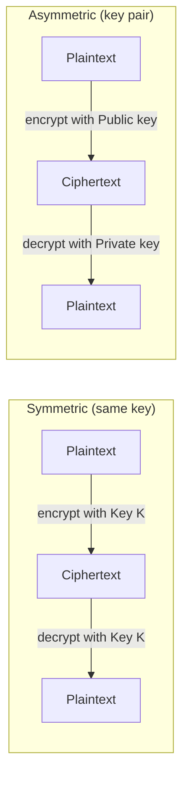
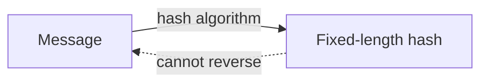
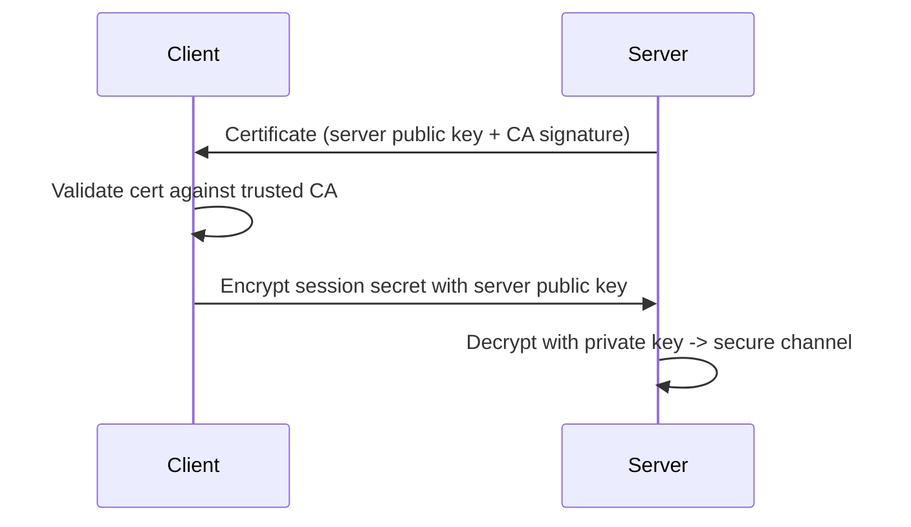
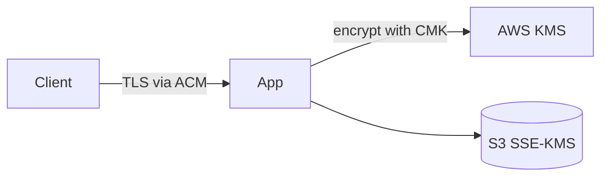
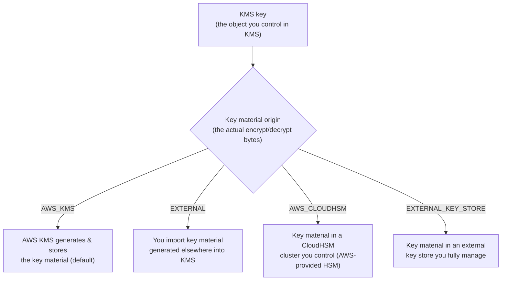
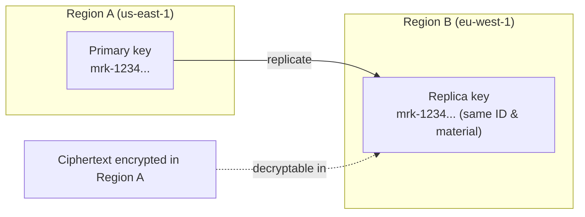

<!--
  Source of truth for this course. After editing the metadata below, mirror
  Type/Points/Status/Date into the tracker table in the root README.md and
  refresh the Progress Summary dashboard.
-->

# AWS Security Engineer: Protecting and Encrypting Data

## Metadata

| Field           | Value                                                        |
| --------------- | ------------------------------------------------------------ |
| Name            | AWS Security Engineer: Protecting and Encrypting Data        |
| Type            | Course                                                       |
| Points          | 80 (≈1h)                                                     |
| Status          | In progress                                                  |
| Date completed  | —                                                            |
| Skill Builder   | https://skillbuilder.aws/learn/MJPE1TPS52/aws-security-engineer--protecting-and-encrypting-data/YVZ3YRWQEK                                   |

> Reminder: Professional recert needs **700 points total** including **at least
> 2 practical activities (labs)**. "Type = Lab" counts toward the 2-lab minimum.

## Course Outline

- **Introduction** — How to Use This Course · Course Overview
- **Keys, Certificates and Encryption** — Preliminary concepts · **Managing Keys
  and Certificates on AWS** ← current · Deployment Considerations
- **Protecting data at rest** — Data encryption at rest · Data Integrity ·
  Masking and redacting data · Retention and Lifecycle management · Data
  replication and backups
- **Protecting data in transit** — Requiring encryption at edge · Secure and
  Private Access to Compute Resources · Inter-resource encryption
- **Conclusion** — Knowledge Check · Recap and Resources · Contact Us

## Key Takeaways

- **Symmetric vs. asymmetric encryption** — Symmetric encryption uses the *same*
  key to encrypt and decrypt. Asymmetric encryption uses a *key pair*: one key
  encrypts and a different (mathematically related) key decrypts.
- **Hashing is one-way** — Hashing applies an algorithm to a message to produce
  a fixed, randomized string of bits (a hash). Unlike encryption, it is a
  one-way operation: the hash cannot be reversed back to the original plaintext.
  Useful for integrity checks, not confidentiality.
- **Digital certificates prove identity** — A digital certificate is an
  electronic credential that proves the authenticity of a user, device, server,
  or website. It relies on public-key cryptography to validate identities of
  parties communicating over a network.

## Services Covered

- **AWS KMS** — Create and manage encryption keys (symmetric CMKs, asymmetric
  key pairs); envelope encryption for data at rest.
- **AWS Certificate Manager (ACM)** — Provision, manage, and deploy digital
  certificates (public-key) for TLS/HTTPS on AWS resources.
- **Amazon S3 encryption (SSE-KMS / SSE-S3)** — Encrypt objects at rest; enforce
  encryption in transit via bucket policies (`aws:SecureTransport`).
- **AWS Secrets Manager** — Store, rotate, and protect secrets used by
  applications and services.
- **Amazon Macie** — Discover, classify, mask/redact sensitive data (PII) at
  scale for data protection and integrity.

## Diagrams

**Symmetric vs. asymmetric encryption**

**Hashing is one-way**

**Digital certificate proves identity (TLS handshake)**

**Protecting data at rest & in transit on AWS**

**KMS key vs. key material origin**

**Multi-Region Key (MRK) replication**

## Screenshots

_No screenshots yet._ When you capture one, save it under this folder's
`./assets/` directory and embed it in this section.

## Notes / Scratchpad

- **Symmetric vs Asymmetric**

  Symmetric encryption uses the same key to encrypt and to decrypt. Asymmetric
  encryption uses one key to encrypt and another to decrypt.

- **Hash**

  Hashing is another application of cryptography in which an algorithm is applied
  to a message to generate a randomized string of bits — this time a hash.
  However, unlike encryption, hashing is a one-way operation: the hash material
  cannot be converted back to plaintext.

- **Digital certificate**

  A digital certificate is an electronic credential that proves the authenticity
  of a user, device, server, or website. This form of authentication uses
  public-key encryption to validate identities communicating over networks.

### About key materials

AWS distinguishes between the key, the object you control with KMS, and the key
material, the actual bytes used to encrypt and decrypt values.

There are four **key material origins**. The two things that separate them are
*where the key material lives* and *who performs the crypto operations*:

- **`AWS_KMS` (default)** — AWS KMS generates and stores the key material, and
  AWS performs the crypto. Simplest option; least for you to manage.

- **`EXTERNAL` (import your own material)** — You generate the key material
  outside AWS, then **import the bytes into KMS**. After import it lives *inside*
  KMS and **AWS performs the crypto**. You keep the original copy yourself (KMS
  does not back up imported material), so you can delete it from KMS as a kill
  switch. Use when you must control key *generation*/provenance but are fine with
  AWS holding and using the material afterward.

- **`AWS_CLOUDHSM` (CloudHSM key store)** — Key material lives in a CloudHSM
  cluster that AWS provides but **you control**. Crypto runs in your HSM cluster.

- **`EXTERNAL_KEY_STORE` / XKS (external key store)** — Key material **never
  enters AWS at all**. It stays in an external key manager you run, and **every
  crypto operation is proxied out to that external system** (KMS forwards
  requests through an XKS proxy). Use when regulation/data-sovereignty requires
  AWS to *never* possess the key material. Trade-off: added latency and an
  availability dependency — if your external store/proxy is down, KMS operations
  fail.

**EXTERNAL vs EXTERNAL_KEY_STORE (the confusing pair):**

- `EXTERNAL` = you *import* the material → it ends up **inside** AWS KMS, and AWS
  does the crypto. Driver: control how the key is *created*.
- `EXTERNAL_KEY_STORE` = the material stays **outside** AWS permanently, and your
  external system does the crypto. Driver: AWS must never hold the material.

**Origin capabilities (who runs the crypto + key-type support):**

| Origin               | Where crypto runs        | Material lives     | Key types supported                         |
| -------------------- | ------------------------ | ------------------ | ------------------------------------------- |
| `AWS_KMS` (default)  | AWS KMS                  | In KMS (AWS-gen)   | Symmetric, asymmetric, HMAC                  |
| `EXTERNAL` (import)  | AWS KMS                  | In KMS (imported)  | Mostly symmetric; asymmetric/HMAC also importable; limited rotation |
| `AWS_CLOUDHSM`       | Your CloudHSM cluster    | In your CloudHSM   | Symmetric (and some RSA); restricted specs  |
| `EXTERNAL_KEY_STORE` | Your external key mgr    | Outside AWS        | **Symmetric only** (AES-256, ENCRYPT_DECRYPT) |

Rules of thumb:

- **KMS itself performs the crypto** only for `AWS_KMS` and `EXTERNAL`. For
  `AWS_CLOUDHSM` and `EXTERNAL_KEY_STORE` the crypto happens *outside* KMS (in
  your HSM cluster or your external key manager).
- The **symmetric-only restriction is tightest for `EXTERNAL_KEY_STORE`** (XKS):
  AES-256, encrypt/decrypt usage only — no asymmetric, no HMAC, no signing.
  Custom key stores (CloudHSM) are similarly limited

### Multi-Region Keys (MRK) — replicate a key across regions

You can replicate a KMS key from one region to another. This creates a
**multi-region key**, whose key ID uses the **`mrk-` prefix**.

- A primary key in one region can be replicated to a **replica key** in another
  region. They share the same key ID and key material, so ciphertext encrypted
  in one region can be decrypted in another without re-encrypting.
- Required for certain cross-region features — for example **DynamoDB global
  tables** with customer-managed encryption need an MRK so all regional replicas
  can decrypt the data.
