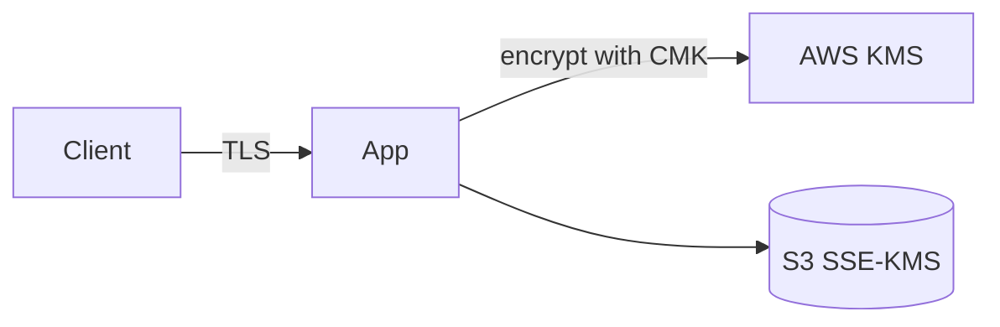

<!--
  Source of truth for this course. After editing the metadata below, mirror
  Type/Points/Status/Date into the tracker table in the root README.md and
  refresh the Progress Summary dashboard.
-->

# AWS Security Engineer: Protecting and Encrypting Data

## Metadata

| Field           | Value                                                        |
| --------------- | ------------------------------------------------------------ |
| Name            | AWS Security Engineer: Protecting and Encrypting Data        |
| Type            | Course                                                       |
| Points          | 80 (≈1h)                                                     |
| Status          | In progress                                                  |
| Date completed  | —                                                            |
| Skill Builder   | <paste the course/lab URL>                                   |

> Reminder: Professional recert needs **700 points total** including **at least
> 2 practical activities (labs)**. "Type = Lab" counts toward the 2-lab minimum.

## Key Takeaways

- <Bullet the most important concepts you learned.>

## Services Covered

- <e.g., AWS KMS> — <how it was used>
- <e.g., Amazon S3 encryption / SSE-KMS> — <...>
- <e.g., AWS Certificate Manager, Secrets Manager> — <...>

## Diagrams



## Screenshots

Store images in `./assets/` and embed them here:

```md

```

## Notes / Scratchpad

- <Gotchas, follow-up reading, questions.>
