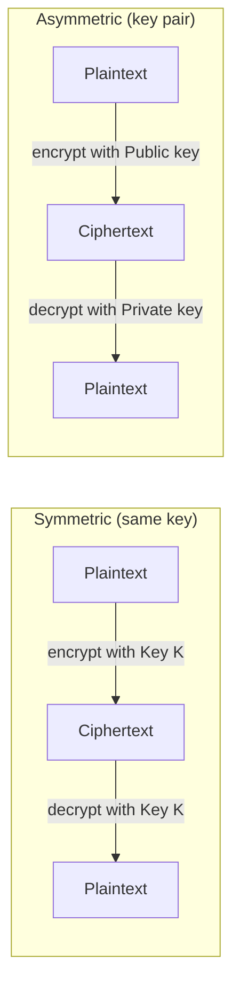
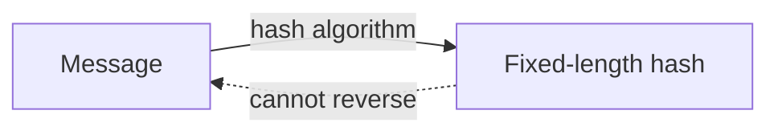
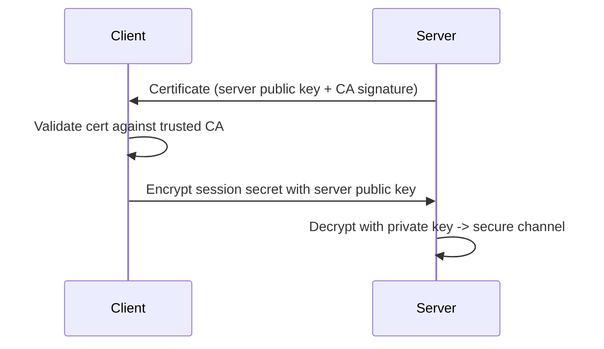
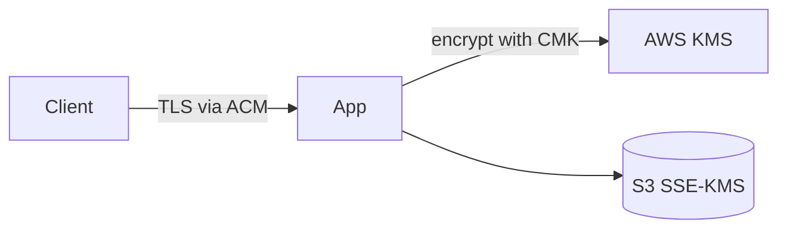
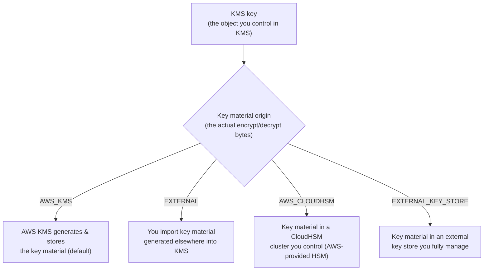
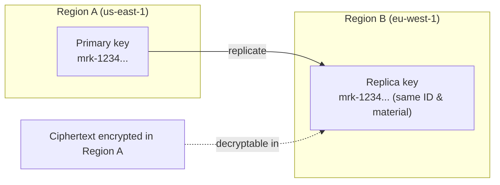

<!--
  Source of truth for this course. After editing the metadata below, mirror
  Type/Points/Status/Date into the tracker table in the root README.md and
  refresh the Progress Summary dashboard.
-->

# AWS Security Engineer: Protecting and Encrypting Data

## Metadata

| Field           | Value                                                        |
| --------------- | ------------------------------------------------------------ |
| Name            | AWS Security Engineer: Protecting and Encrypting Data        |
| Type            | Course                                                       |
| Points          | 80 (≈1h)                                                     |
| Status          | In progress                                                  |
| Date completed  | —                                                            |
| Skill Builder   | https://skillbuilder.aws/learn/MJPE1TPS52/aws-security-engineer--protecting-and-encrypting-data/YVZ3YRWQEK                                   |

> Reminder: Professional recert needs **700 points total** including **at least
> 2 practical activities (labs)**. "Type = Lab" counts toward the 2-lab minimum.

## Course Outline

- **Introduction** — How to Use This Course · Course Overview
- **Keys, Certificates and Encryption** — Preliminary concepts · **Managing Keys
  and Certificates on AWS** ← current · Deployment Considerations
- **Protecting data at rest** — Data encryption at rest · Data Integrity ·
  Masking and redacting data · Retention and Lifecycle management · Data
  replication and backups
- **Protecting data in transit** — Requiring encryption at edge · Secure and
  Private Access to Compute Resources · Inter-resource encryption
- **Conclusion** — Knowledge Check · Recap and Resources · Contact Us

## Key Takeaways

- **Symmetric vs. asymmetric encryption** — Symmetric encryption uses the *same*
  key to encrypt and decrypt. Asymmetric encryption uses a *key pair*: one key
  encrypts and a different (mathematically related) key decrypts.
- **Hashing is one-way** — Hashing applies an algorithm to a message to produce
  a fixed, randomized string of bits (a hash). Unlike encryption, it is a
  one-way operation: the hash cannot be reversed back to the original plaintext.
  Useful for integrity checks, not confidentiality.
- **Digital certificates prove identity** — A digital certificate is an
  electronic credential that proves the authenticity of a user, device, server,
  or website. It relies on public-key cryptography to validate identities of
  parties communicating over a network.

## Services Covered

- **AWS KMS** — Create and manage encryption keys (symmetric CMKs, asymmetric
  key pairs); envelope encryption for data at rest.
- **AWS Certificate Manager (ACM)** — Provision, manage, and deploy digital
  certificates (public-key) for TLS/HTTPS on AWS resources.
- **Amazon S3 encryption (SSE-KMS / SSE-S3)** — Encrypt objects at rest; enforce
  encryption in transit via bucket policies (`aws:SecureTransport`).
- **AWS Secrets Manager** — Store, rotate, and protect secrets used by
  applications and services.
- **Amazon Macie** — Discover, classify, mask/redact sensitive data (PII) at
  scale for data protection and integrity.

## Diagrams

**Symmetric vs. asymmetric encryption**



**Hashing is one-way**



**Digital certificate proves identity (TLS handshake)**



**Protecting data at rest & in transit on AWS**



**KMS key vs. key material origin**



**Multi-Region Key (MRK) replication**



## Screenshots

_No screenshots yet._ When you capture one, save it under this folder's
`./assets/` directory and embed it in this section.

## Notes / Scratchpad

- **Symmetric vs Asymmetric**

  Symmetric encryption uses the same key to encrypt and to decrypt. Asymmetric
  encryption uses one key to encrypt and another to decrypt.

- **Hash**

  Hashing is another application of cryptography in which an algorithm is applied
  to a message to generate a randomized string of bits — this time a hash.
  However, unlike encryption, hashing is a one-way operation: the hash material
  cannot be converted back to plaintext.

- **Digital certificate**

  A digital certificate is an electronic credential that proves the authenticity
  of a user, device, server, or website. This form of authentication uses
  public-key encryption to validate identities communicating over networks.


### About key materials

AWS distinguishes between the key, the object you control with KMS, and the key
material, the actual bytes used to encrypt and decrypt values.

There are four **key material origins**. The two things that separate them are
*where the key material lives* and *who performs the crypto operations*:

- **`AWS_KMS` (default)** — AWS KMS generates and stores the key material, and
  AWS performs the crypto. Simplest option; least for you to manage.

- **`EXTERNAL` (import your own material)** — You generate the key material
  outside AWS, then **import the bytes into KMS**. After import it lives *inside*
  KMS and **AWS performs the crypto**. You keep the original copy yourself (KMS
  does not back up imported material), so you can delete it from KMS as a kill
  switch. Use when you must control key *generation*/provenance but are fine with
  AWS holding and using the material afterward.

- **`AWS_CLOUDHSM` (CloudHSM key store)** — Key material lives in a CloudHSM
  cluster that AWS provides but **you control**. Crypto runs in your HSM cluster.

- **`EXTERNAL_KEY_STORE` / XKS (external key store)** — Key material **never
  enters AWS at all**. It stays in an external key manager you run, and **every
  crypto operation is proxied out to that external system** (KMS forwards
  requests through an XKS proxy). Use when regulation/data-sovereignty requires
  AWS to *never* possess the key material. Trade-off: added latency and an
  availability dependency — if your external store/proxy is down, KMS operations
  fail.

**EXTERNAL vs EXTERNAL_KEY_STORE (the confusing pair):**

- `EXTERNAL` = you *import* the material → it ends up **inside** AWS KMS, and AWS
  does the crypto. Driver: control how the key is *created*.
- `EXTERNAL_KEY_STORE` = the material stays **outside** AWS permanently, and your
  external system does the crypto. Driver: AWS must never hold the material.

**Origin capabilities (who runs the crypto + key-type support):**

| Origin               | Where crypto runs        | Material lives     | Key types supported                         |
| -------------------- | ------------------------ | ------------------ | ------------------------------------------- |
| `AWS_KMS` (default)  | AWS KMS                  | In KMS (AWS-gen)   | Symmetric, asymmetric, HMAC                  |
| `EXTERNAL` (import)  | AWS KMS                  | In KMS (imported)  | Mostly symmetric; asymmetric/HMAC also importable; limited rotation |
| `AWS_CLOUDHSM`       | Your CloudHSM cluster    | In your CloudHSM   | Symmetric (and some RSA); restricted specs  |
| `EXTERNAL_KEY_STORE` | Your external key mgr    | Outside AWS        | **Symmetric only** (AES-256, ENCRYPT_DECRYPT) |

Rules of thumb:

- **KMS itself performs the crypto** only for `AWS_KMS` and `EXTERNAL`. For
  `AWS_CLOUDHSM` and `EXTERNAL_KEY_STORE` the crypto happens *outside* KMS (in
  your HSM cluster or your external key manager).
- The **symmetric-only restriction is tightest for `EXTERNAL_KEY_STORE`** (XKS):
  AES-256, encrypt/decrypt usage only — no asymmetric, no HMAC, no signing.
  Custom key stores (CloudHSM) are similarly limited


### Multi-Region Keys (MRK) — replicate a key across regions

You can replicate a KMS key from one region to another. This creates a
**multi-region key**, whose key ID uses the **`mrk-` prefix**.

- A primary key in one region can be replicated to a **replica key** in another
  region. They share the same key ID and key material, so ciphertext encrypted
  in one region can be decrypted in another without re-encrypting.
- Required for certain cross-region features — for example **DynamoDB global
  tables** with customer-managed encryption need an MRK so all regional replicas
  can decrypt the data.


#### Specific service encryption

- **Amazon S3**

  By default, all objects in Amazon S3 are encrypted with S3-managed keys
  (SSE-S3, AES-256) before they are stored on disk. You can instead choose
  SSE-KMS (a KMS key) or SSE-C (customer-provided keys).

  **S3 Bucket Key (cost optimization for SSE-KMS):** S3 can generate a
  short-lived bucket-level key that is used to encrypt objects, so S3 does not
  have to call KMS for every object operation. This reduces KMS request volume
  (and cost) for buckets with many SSE-KMS objects.

- **Amazon EBS**

  EBS encryption uses a KMS key. By default (when encryption is enabled) it uses
  the AWS managed key `aws/ebs`, but you can specify a different customer-managed
  key. Note: volumes are only encrypted if you enable encryption (per-volume or
  via account-level "encryption by default").

- **Amazon FSx**

  Managed file-system family; **all four flavors support encryption at rest
  (KMS-backed) and in transit**:

  - **FSx for Windows File Server** — Windows/NTFS shares over **SMB**, with
    Active Directory integration. (SMB is the *protocol*, not an FSx type.)
  - **FSx for Lustre** — high-performance parallel file system (POSIX) for
    HPC/ML; integrates with **S3** (present bucket objects as files). The "fast"
    one.
  - **FSx for NetApp ONTAP** — enterprise storage; multi-protocol **NFS, SMB,
    iSCSI**; snapshots, dedup/compression, SnapMirror replication.
  - **FSx for OpenZFS** — ZFS file systems over **NFS**; snapshots and cloning.

**Gotcha — encryption state / KMS key is set at creation:**

- **EBS:** you *cannot* change encryption on an existing volume — you can't turn
  encryption on for an unencrypted volume, nor swap to a different KMS key in
  place (per AWS docs: "You cannot change the KMS key that is associated with an
  existing snapshot or volume"). Workarounds:
  - *Encrypt an unencrypted volume:* snapshot it, then create a **new encrypted
    volume from that snapshot**.
  - *Re-key (change to a different KMS key):* perform a **snapshot copy** and
    associate the new KMS key during the copy; the resulting snapshot is
    encrypted with the new key. Encryption can never be *removed* once set.

  ```text
  Encrypt an UNENCRYPTED volume:

    [Unencrypted volume]
           |
           |  create snapshot
           v
    [Unencrypted snapshot]
           |
           |  create volume  (enable encryption, pick KMS key)
           v
    [NEW encrypted volume]   <-- encryption applied here, not in place


  Re-key an ENCRYPTED volume/snapshot (change to a DIFFERENT KMS key):

    [Snapshot encrypted with KMS key A]
           |
           |  CopySnapshot  --KmsKeyId = key B   (Encrypted=true)
           v
    [NEW snapshot encrypted with KMS key B]
           |
           |  create volume from copy
           v
    [Volume encrypted with key B]

    Note: the original stays on key A; the key change lands on the COPY.
  ```
- **FSx:** at-rest encryption is enabled automatically at creation, and for
  persistent file systems you **choose the KMS key at create time**. There is no
  in-place "change to a different KMS key" for an existing file system — to
  change it you go through a **backup → restore** flow onto a new file system.
  Notes: FSx accepts **symmetric KMS keys only**; with a customer-managed key you
  can enable **annual key rotation** (rotates that key's material, which is *not*
  the same as switching to a different key).


#### Data Integrity

For **Amazon S3**, several options help ensure data stays correct:

- Redundancy and durability
- Access control
- Versioning
- Object locking
- Encryption

For **Amazon EBS**: at no additional charge, EBS volume data is replicated across
multiple servers within an Availability Zone to prevent data loss from the
failure of any single component.

For **Amazon FSx**: automatically replicates your data within or across
Availability Zones. It also integrates with **AWS Backup** for centralized backup
management and an additional level of compliance.

#### Masking and redacting data

**Personally Identifiable Information (PII)** is any data that could be used to
identify an individual — for example, addresses, bank account numbers, and phone
numbers.

You can help safeguard sensitive data ingested by **CloudWatch Logs** using
**log group data protection policies**:

- Data is masked **at ingestion**, so log events ingested *before* the policy
  existed may not be masked.
- Only users/roles with the **`logs:Unmask`** IAM permission can view the
  unmasked data.

**Types of data CloudWatch Logs can detect** (managed data identifiers). When a
match is found, a CloudWatch **metric is emitted**:

- **Credentials** — e.g., private keys, AWS secret access keys.
- **Financial information** — e.g., credit card numbers.
- **PII (Personally Identifiable Information)** — e.g., driver's licenses,
  social security numbers.
- **PHI (Protected Health Information)** — e.g., health insurance / medical
  identification numbers.
- **Device identifiers** — e.g., IP addresses, MAC addresses.
- **Custom data identifiers** — define your own patterns for your use case.

**Amazon SNS — Message Data Protection**

A feature that lets you define rules/policies to **audit and control the message
content** flowing through SNS topics — governance, compliance, and auditing for
sensitive data. It can **audit**, **de-identify (mask/redact)**, and
**block/deny** messages containing sensitive data (using managed data
identifiers similar to CloudWatch Logs).

> Note: per AWS docs, **SNS message data protection is no longer available to new
> customers** — keep this in mind for real-world use vs. exam trivia.

Detecting custom sensitive data

Amazon macie is a service that enables you to automate discovery, logging and reporting of sensitive data in your S3.
Allows you to detect common managed identifiers, or define custom identifiers using regular expresions.

Another service that can do this task is AWS glue, and with some lines the amazon comprehend also can be used to this matter.


#### Retention and Lifecycle management

**Amazon EFS — storage lifecycle management**

EFS can automatically move files between storage classes to save cost, based on
**when a file was last accessed** (accessing a file resets its lifecycle timer).
Policies apply to the **entire file system** and comprise three lifecycle
policies:

- **Transition into IA** — move files into **Infrequent Access (IA)** after N
  days without access.
- **Transition into Archive** — move colder files into the **Archive** storage
  class.
- **Transition out of IA/Archive** — optionally move files back to **Standard**
  on first access.

**Amazon S3 — Object Lock (WORM retention)**

S3 Object Lock stores objects using a **write-once-read-many (WORM)** model to
prevent objects from being **deleted or overwritten** for a fixed time or
indefinitely. Useful for regulatory/compliance requirements. It offers two
mechanisms (an object version can have either or both):

- **Retention period** — protect the object version until a *retain-until-date*.
- **Legal hold** — protects the object version until you **explicitly remove**
  it (no expiry date).

Two **retention modes**:

- **Governance mode** — users can't overwrite/delete or change lock settings
  **unless** they have special permission (`s3:BypassGovernanceRetention`).
  Good for internal controls you may need to override.
- **Compliance mode** — a protected version **can't be overwritten or deleted by
  anyone, including the AWS account root user**, until the retention period
  expires. The retention period can't be shortened and the mode can't be
  changed. Strictest — for true regulatory WORM.

> Object Lock requires **versioning** on the bucket. Retention/legal hold protect
> the *specific object version*, and don't stop new versions being created.

**Amazon S3 — Lifecycle rules**

S3 Lifecycle rules automate moving/removing objects to manage cost. Two action
types:

- **Transition actions** — move objects to a lower-cost storage class after N
  days (e.g., → S3 Standard-IA after 30 days, → S3 Glacier Flexible Retrieval
  after 1 year).
- **Expiration actions** — S3 **deletes** expired objects on your behalf after N
  days (can also clean up incomplete multipart uploads and old noncurrent
  versions).

> Note: an S3 Object Lock retention/legal hold **overrides** lifecycle deletion —
> a lifecycle rule can't expire an object that is still locked.

**Amazon FSx — backup policies (retention)**

FSx supports backups you can use to meet retention/compliance needs:

- **Automatic daily backups** — enabled by default, taken during a configurable
  daily backup window, kept for a **retention period** (default 30 days in the
  console).
- **User-initiated backups** — take an on-demand backup at any time.
- Backups are **file-system-consistent, incremental, highly durable**, and
  stored in **Amazon S3**.
- **AWS Backup** integration — centralize backups across AWS services with backup
  plans that support different **frequencies and retention periods** (an extra
  level of compliance/governance).

### Protecting data in transit — connectivity & access options

Options for encrypting/securing traffic to and between resources:

- **AWS PrivateLink** — private connectivity between VPCs and AWS/partner/your
  own services using **interface VPC endpoints**, so traffic stays on the **AWS
  private network** and never traverses the public internet. Reduces exposure;
  pairs with TLS on the service endpoint for encryption.

- **AWS Client VPN** — managed, client-based **remote-access VPN**. Users connect
  from their devices over an **encrypted TLS tunnel (OpenVPN-based)** to reach
  resources in AWS (and on-prem). For individual users/remote workforce.

- **AWS Verified Access** — provides secure access to applications **without a
  VPN**, using a **zero-trust** model: it evaluates **each request in real time**
  against identity and device/security signals before granting access. Makes
  lateral movement between apps hard (unlike VPNs that grant broad network
  access once connected).

  > Naming gotcha: "AWS Verified Access" and "Amazon Verified Access" are the
  > **same** service. Don't confuse it with **AWS Verified *Permissions***, a
  > *different* service for fine-grained app authorization (Cedar policy
  > language) — that one is about permissions, not network access.

- **Site-to-Site VPN** — **encrypted IPsec tunnels** between your on-premises
  network (customer gateway) and AWS (virtual private gateway / transit gateway).
  For connecting whole networks (data center ↔ VPC) over the internet.

- **AWS Direct Connect** — a **dedicated private network link** from on-prem to
  AWS (not over the internet). Note: Direct Connect by itself is **not encrypted**
  — layer a **VPN over it (or MACsec** on supported connections) if you need
  encryption in transit.

- **AWS Nitro System** — on supported EC2 instance types, the Nitro hardware
  **automatically encrypts in-transit traffic between instances** (offloaded to
  Nitro), and provides strong isolation. No config on the app side; depends on
  instance type/placement.

Quick framing:

- **Individual users →** Client VPN or **Verified Access** (zero-trust, no VPN).
- **Whole networks (hybrid) →** Site-to-Site VPN (encrypted over internet) or
  **Direct Connect** (dedicated; add VPN/MACsec for encryption).
- **Private service access (no public internet) →** PrivateLink.
- **Between EC2 instances →** Nitro auto-encryption on supported types.

### Data Replication and backups

The services provided by aws are:
- amazon data lifecycle manager: automates the creation,retention, and deletion of EBS snapshot and ebs-backed images

- aws data sync: an online data movement service that simplified and accelerate data migrations to AWS as well as moving
data to and from on-premises storage, edge locations, other cloud provders

- aws backup: fuly managed service that centralize and automates data protecttiona cross AWS services and hybrid workloads


