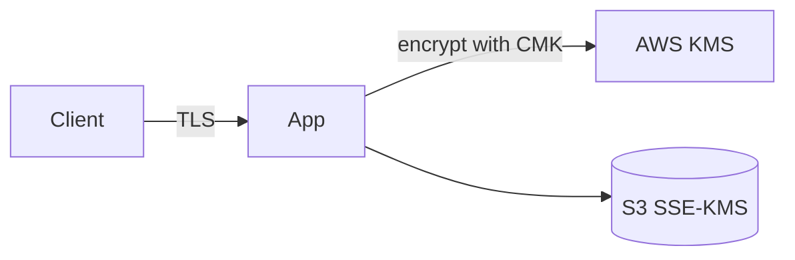

<!--
  Source of truth for this course. After editing the metadata below, mirror
  Type/Points/Status/Date into the tracker table in the root README.md and
  refresh the Progress Summary dashboard.
-->

# AWS Security Engineer: Protecting and Encrypting Data

## Metadata

| Field           | Value                                                        |
| --------------- | ------------------------------------------------------------ |
| Name            | AWS Security Engineer: Protecting and Encrypting Data        |
| Type            | Course                                                       |
| Points          | 80 (≈1h)                                                     |
| Status          | In progress                                                  |
| Date completed  | —                                                            |
| Skill Builder   | <paste the course/lab URL>                                   |

> Reminder: Professional recert needs **700 points total** including **at least
> 2 practical activities (labs)**. "Type = Lab" counts toward the 2-lab minimum.

## Course Outline

- **Introduction** — How to Use This Course · Course Overview
- **Keys, Certificates and Encryption** — Preliminary concepts · Managing Keys
  and Certificates on AWS · Deployment Considerations
- **Protecting data at rest** — Data encryption at rest · Data Integrity ·
  Masking and redacting data · Retention and Lifecycle management · Data
  replication and backups
- **Protecting data in transit** — Requiring encryption at edge · Secure and
  Private Access to Compute Resources · Inter-resource encryption
- **Conclusion** — Knowledge Check · Recap and Resources · Contact Us

## Key Takeaways

- **Symmetric vs. asymmetric encryption** — Symmetric encryption uses the *same*
  key to encrypt and decrypt. Asymmetric encryption uses a *key pair*: one key
  encrypts and a different (mathematically related) key decrypts.
- **Hashing is one-way** — Hashing applies an algorithm to a message to produce
  a fixed, randomized string of bits (a hash). Unlike encryption, it is a
  one-way operation: the hash cannot be reversed back to the original plaintext.
  Useful for integrity checks, not confidentiality.
- **Digital certificates prove identity** — A digital certificate is an
  electronic credential that proves the authenticity of a user, device, server,
  or website. It relies on public-key cryptography to validate identities of
  parties communicating over a network.

## Services Covered

- **AWS KMS** — Create and manage encryption keys (symmetric CMKs, asymmetric
  key pairs); envelope encryption for data at rest.
- **AWS Certificate Manager (ACM)** — Provision, manage, and deploy digital
  certificates (public-key) for TLS/HTTPS on AWS resources.
- **Amazon S3 encryption (SSE-KMS / SSE-S3)** — Encrypt objects at rest; enforce
  encryption in transit via bucket policies (`aws:SecureTransport`).
- **AWS Secrets Manager** — Store, rotate, and protect secrets used by
  applications and services.
- **Amazon Macie** — Discover, classify, mask/redact sensitive data (PII) at
  scale for data protection and integrity.

## Diagrams



## Screenshots

Store images in `./assets/` and embed them here:

```md

```

## Notes / Scratchpad

- <Gotchas, follow-up reading, questions.>
