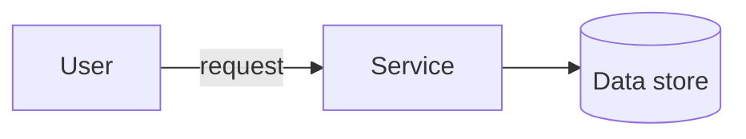

<!--
  PER-COURSE NOTES TEMPLATE
  Copy this whole folder (_TEMPLATE/) to courses/NN-short-slug/ for each new
  course or lab, then fill in the metadata block and sections below.
  This file is the SOURCE OF TRUTH for the course. After editing it, mirror the
  key metadata (Type, Points, Status, Date completed) into the tracker table in
  the root README.md and refresh the Progress Summary dashboard.
-->

# AWS Security Engineer: Edge Security

## Metadata

| Field           | Value                                                        |
| --------------- | ------------------------------------------------------------ |
| Name            | AWS Security Engineer: Edge Security                         |
| Type            | Course                                                       |
| Points          | 100 (≈1h15m)                                                 |
| Status          | In progress                                                  |
| Date completed  | —                                                            |
| Skill Builder   | https://skillbuilder.aws/learn/Q8QC4V4BMF/aws-security-engineer-edge-security/M3ZVNJGPX7 |

> Reminder: Professional recert needs **700 points total** including **at least
> 2 practical activities (labs)**. "Type = Lab" counts toward the 2-lab minimum.

## Key Takeaways

- <Bullet the most important concepts you learned.>
- <What surprised you / what to remember for real work.>

## Services Covered

- <AWS service> — <one-line note on how it was used>
- <AWS service> — <...>

## Diagrams

Prefer inline Mermaid for architecture/flow (version-control friendly). Example:



## Screenshots

Store images in this folder's `./assets/` directory and embed them here:

```md

```

## Notes / Scratchpad

- <Anything else: gotchas, follow-up reading, questions.>
