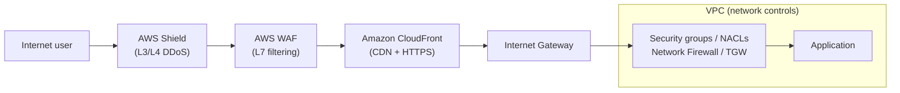
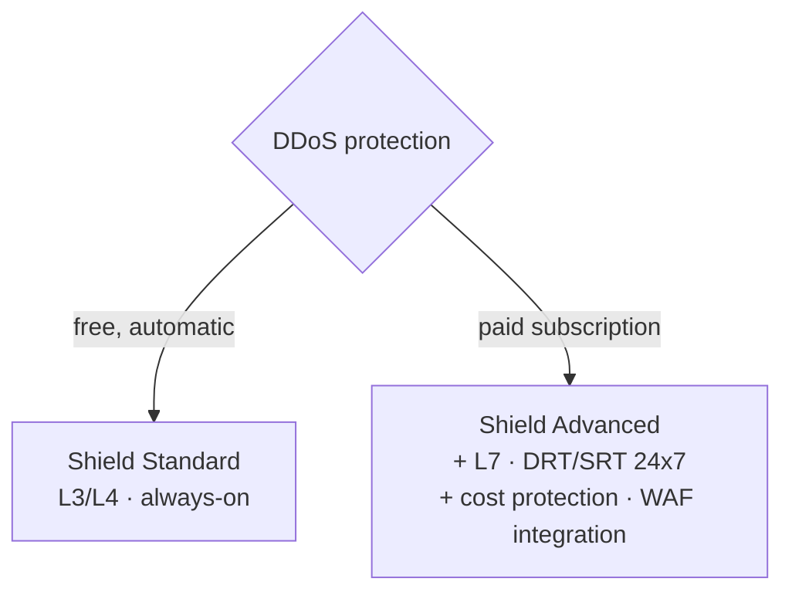
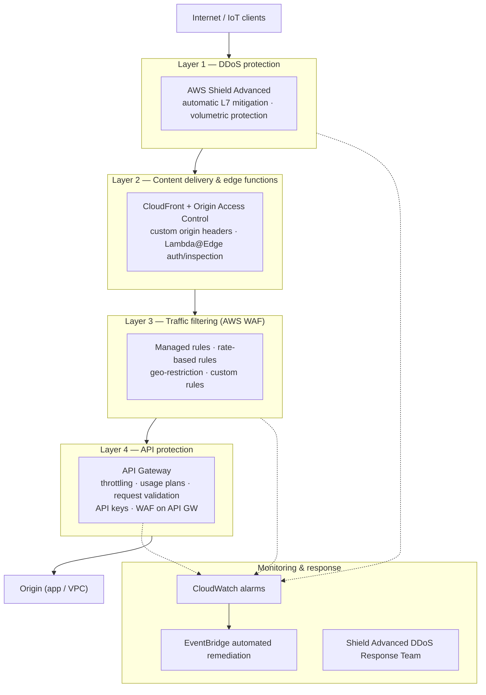
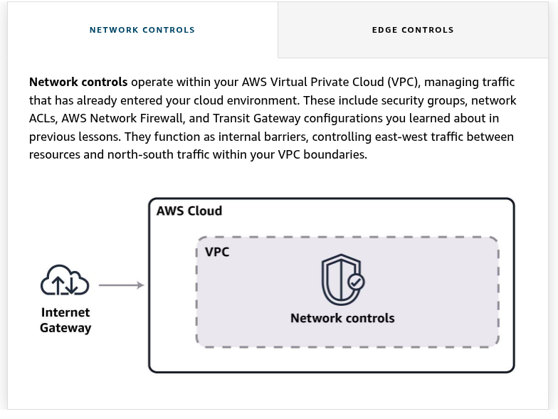
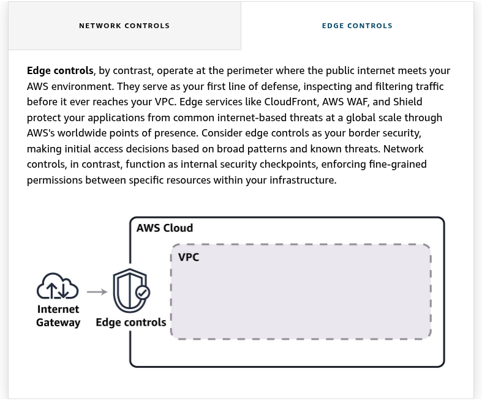

<!--
  PER-COURSE NOTES TEMPLATE
  Copy this whole folder (_TEMPLATE/) to courses/NN-short-slug/ for each new
  course or lab, then fill in the metadata block and sections below.
  This file is the SOURCE OF TRUTH for the course. After editing it, mirror the
  key metadata (Type, Points, Status, Date completed) into the tracker table in
  the root README.md and refresh the Progress Summary dashboard.
-->

# AWS Security Engineer: Edge Security

## Metadata

| Field           | Value                                                        |
| --------------- | ------------------------------------------------------------ |
| Name            | AWS Security Engineer: Edge Security                         |
| Type            | Course                                                       |
| Points          | 100 (≈1h15m)                                                 |
| Status          | In progress                                                  |
| Date completed  | —                                                            |
| Skill Builder   | https://skillbuilder.aws/learn/Q8QC4V4BMF/aws-security-engineer-edge-security/M3ZVNJGPX7 |

> Reminder: Professional recert needs **700 points total** including **at least
> 2 practical activities (labs)**. "Type = Lab" counts toward the 2-lab minimum.

## Key Takeaways

- **Edge vs. network controls** — edge controls (CloudFront, WAF, Shield) sit at
  the *perimeter* and filter internet traffic before it reaches the VPC; network
  controls (security groups, NACLs, Network Firewall, Transit Gateway) are
  *internal* checkpoints between resources.
- **Shield Standard vs. Advanced** — Standard is free/automatic and covers
  **L3/L4** DDoS; Advanced is a paid subscription adding **L7** protection, the
  DDoS Response Team, cost protection, and WAF integration.
- **WAF = L7 request filtering** — inspects HTTP/HTTPS requests and blocks OWASP
  Top 10 patterns (SQL injection, XSS) and malicious bots.
- **CloudFront is both CDN and edge security** — low-latency delivery plus HTTPS,
  field-level encryption, and geo access controls at AWS's points of presence.

## Services Covered

- **AWS Shield (Standard & Advanced)** — managed DDoS protection at the edge
  (L3/L4 always-on; L7 + DRT/cost protection with Advanced).
- **AWS WAF** — L7 web application firewall filtering HTTP/HTTPS requests
  (SQLi, XSS, bots, OWASP Top 10); managed, rate-based, geo, and custom rules.
- **Amazon CloudFront** — global CDN with edge security (HTTPS, field-level
  encryption, geo restrictions); Origin Access Control (OAC) and custom origin
  headers.
- **AWS Lambda@Edge** — run custom authentication / request inspection at
  CloudFront edge locations.
- **Amazon API Gateway** — API protection: throttling, usage plans, request
  validation, API keys, and WAF integration.
- **AWS IoT Core (IoT policies)** — scope device actions (MQTT publish/subscribe,
  client IDs, thing type) for least-privilege fleets.
- **AWS Verified Access** — zero-trust, VPN-less application access; evaluates
  each request against identity + device posture rules (trust providers).
- **Amazon Route 53 / AWS Global Accelerator** — edge-facing services protected
  by Shield.
- **Amazon CloudWatch & Amazon EventBridge** — monitoring (alarms) and automated
  remediation workflows for edge threats.

## Diagrams

**Edge controls vs. network controls (defense in depth)**



**Shield Standard vs. Advanced**



**Multi-layered edge defense strategy** — ordered layers protecting every entry
point (IoT, web apps, APIs) before traffic reaches the origin, with a
monitoring/response loop:



## Screenshots

**Network controls vs. edge controls** — network controls operate *inside* the
VPC (security groups, network ACLs, AWS Network Firewall, Transit Gateway),
acting as internal barriers for east-west and north-south traffic within your
VPC boundaries.



**Edge controls** operate at the *perimeter*, where the public internet meets
your AWS environment — the first line of defense, inspecting and filtering
traffic before it reaches your VPC. Edge services like **CloudFront**, **AWS
WAF**, and **AWS Shield** protect applications from internet-based threats at
global scale via AWS's points of presence (think "border security"), while
network controls act as internal checkpoints between resources.



## Notes / Scratchpad

The AWS edge security landscape:

- **AWS Shield Standard**

  Provides free, automatic protection against common **network and transport
  layer (L3/L4)** DDoS attacks. It defends AWS services like CloudFront, Route 53,
  and Global Accelerator with **always-on detection and inline mitigation**.
  Enabled automatically at no extra charge.

- **AWS Shield Advanced**

  Premium (subscription) service offering enhanced DDoS protection against
  sophisticated **application layer (L7)** attacks. Includes real-time visibility
  into attack vectors, 24/7 access to the **DDoS Response Team (DRT/SRT)**, **cost
  protection** during attacks (absorbing scaling charges from a DDoS), and **AWS
  WAF integration** for high-value applications.

- **AWS WAF**

  Monitors and filters **HTTP/HTTPS** traffic before it reaches your
  applications, protecting them from common web exploits and malicious bots that
  could affect availability, compromise security, or consume excessive resources.
  Provides customizable security rules to inspect web requests and block attack
  patterns including **SQL injection, cross-site scripting (XSS)**, and other
  **OWASP Top 10** vulnerabilities.

- **Amazon CloudFront**

  A global **content delivery network (CDN)** that securely delivers content with
  low latency, while providing robust security features including **HTTPS**,
  **field-level encryption**, and **geographic (geo) access controls**.

### Edge security for IoT devices

IoT devices are a distinct edge-security challenge (huge fleets, weak endpoints).
**AWS IoT policies** scope what each device may do:

- Define which **MQTT topics** a device can **publish/subscribe** to.
- Control which **HTTP APIs** devices can access.
- Limit device actions based on **client IDs** and other attributes.
- Enforce **least-privilege** across the IoT fleet.

**Example policy (explained):**

```json
{
  "Version": "2012-10-17",
  "Statement": [
    {
      "Effect": "Allow",
      "Action": "iot:Connect",
      "Resource": "arn:aws:iot:us-east-1:555555555555:client/${iot:ClientId}",
      "Condition": {
        "Bool": { "iot:Connection.Thing.IsAttached": "true" }
      }
    },
    {
      "Effect": "Allow",
      "Action": "iot:Publish",
      "Resource": "arn:aws:iot:us-east-1:555555555555:topic/device/${iot:ClientId}/data",
      "Condition": {
        "StringEquals": { "iot:Connection.Thing.ThingTypeName": "AuthorizedDeviceType" }
      }
    }
  ]
}
```

- **Statement 1 — `iot:Connect`:** lets a device open an MQTT connection, but the
  resource is scoped with the **`${iot:ClientId}`** policy variable so a device
  can only connect **as its own client ID** (not impersonate another). The
  condition **`iot:Connection.Thing.IsAttached = true`** requires the connecting
  client to be an **IoT thing that is attached** in the registry — blocking
  unregistered/rogue clients.
- **Statement 2 — `iot:Publish`:** allows publishing only to that device's **own
  topic** `device/${iot:ClientId}/data` (again keyed to its client ID, so it
  can't publish to other devices' topics). The condition
  **`iot:Connection.Thing.ThingTypeName = AuthorizedDeviceType`** further
  restricts it to devices of an **approved thing type**.
- Net effect: **least privilege** — each device can connect only as itself and
  publish only to its own data topic, and only if it's a registered thing of an
  authorized type. Policy variables (`${iot:ClientId}`) make one policy safely
  reusable across the whole fleet.

### Implementing a multi-layered edge defense strategy

Beyond device-level (e.g., IoT) controls, protect **all entry points** — IoT
connections, public web apps, and API endpoints — with ordered layers:

- **Layer 1 — DDoS protection:** deploy **AWS Shield Advanced** on public-facing
  resources; enable **automatic application-layer (L7) DDoS mitigation**; helps
  protect against volumetric attacks.
- **Layer 2 — Content delivery & edge functions:** use **CloudFront** with
  **Origin Access Control (OAC)**; add **custom headers** between CloudFront and
  origins; consider **Lambda@Edge** for custom authentication or request
  inspection.
- **Layer 3 — Traffic filtering (AWS WAF):** combine rule types — **managed
  rules** (common threats), **rate-based rules** (abnormal traffic),
  **geo-restriction rules** (location-based access), and **custom rules**
  (app-specific vulnerabilities).
- **Layer 4 — API protection:** configure **API Gateway** with **throttling and
  usage plans**, **request validation** and **API keys**, and attach **WAF to
  API Gateway** for extra protection.

**Monitoring & response:**

- **CloudWatch alarms** for suspicious activity.
- **AWS Shield Advanced DDoS Response Team (DRT/SRT)** access.
- **EventBridge** for automated remediation workflows.


### Advanced edge controls

**Geographic and geolocation controls**

- **Advanced CloudFront geo-restriction** — beyond the built-in country
  allow/block list, you can use a **CloudFront Function** for **path-specific
  geo-restrictions** (apply different geo rules to different URL paths).
- **Amazon Route 53 geolocation routing** — route DNS responses based on the
  geographic location of the requester (for compliance or localized content).
- **DNS-based security controls:**
  - **DNSSEC** — cryptographically signs DNS responses to prevent DNS spoofing /
    cache poisoning.
  - **DNS query logging** — log Route 53 resolver queries for visibility/audit.
  - **Private DNS** — private hosted zones so records resolve only inside your
    VPC(s), not on the public internet.

**Advanced rate-limiting controls**

- **Intelligent rate limiting with WAF** — advanced WAF rate limiting goes beyond
  simple IP-based counting; you can create a rule that limits, for example,
  **login attempts per username/session** (aggregating on request attributes,
  not just source IP).
- **Behavioral rate limiting** — throttle based on abnormal request patterns
  rather than a fixed threshold.
- **JA4 fingerprinting** — a **TLS client fingerprint** used for advanced client
  identification; lets WAF distinguish clients by their TLS handshake
  characteristics (useful against bots that rotate IPs).


**Browser-based challenge integration**

Serve a challenge (e.g., CAPTCHA / silent challenge) that **legitimate users can
solve while automated tools typically fail**, adding a layer of verification
**beyond fingerprinting alone**. (AWS WAF offers **CAPTCHA** and **Challenge**
actions for this.)

**Token-based access controls**

Grant time-bound, revocable access to content/endpoints. Examples:

- **Signed URLs** — a single URL with an embedded, expiring signature (good for
  individual files/temporary access).
- **Signed cookies** — signed credentials in a cookie for **authenticated
  sessions** across multiple objects/paths.

**Device-based access controls**

Grant or deny access based on **who the user is *and* the state of their device**
(zero-trust). The main service:

- **AWS Verified Access** — provides secure, **VPN-less** access to applications;
  evaluates **each request in real time** against **identity** signals *and*
  **device posture/security signals** from **trust providers** (e.g., device is
  managed/compliant, OS patched, disk encrypted).
- Access decisions are expressed as **access policies (rules)** — e.g., *allow
  only if the user is in the Admins group AND the device is compliant*. Failing
  the device rule blocks access even with valid credentials.
- Because each request is evaluated, it limits **lateral movement** between apps
  (unlike a VPN that grants broad network access once connected).

> Don't confuse the two "Verified" services:
> - **AWS Verified Access** — gates **access to applications** (identity + device
>   posture). This is the device-based access control service. *(front door)*
> - **AWS Verified Permissions** — **fine-grained authorization inside your app**
>   (what a user can do), using the **Cedar** policy language. Not device-based.
>   *(what you can touch once inside)*

#### Integrating multiple edge access controls

A layered implementation strategy across four levels:

**Layer 1 — DNS level (Route 53 geolocation routing)**

- Direct users to the appropriate **regional endpoints**.
- Configure **health checks and failover routing**.
- Implement **DNSSEC** for DNS security.
- Monitor DNS query patterns for **anomaly detection**.

**Layer 2 — CDN level (CloudFront)**

- Implement **broad geographic restrictions**.
- Enable **HTTPS**.
- Set up **Origin Access Control (OAC)**.
- Implement **caching**.

**Layer 3 — WAF rules**

- Configure **geo-matching** for granular **path** restrictions.
- Implement **adaptive rate limiting**.
- Deploy **client fingerprinting** detections.
- Enable **XSS** and **SQL injection** protections.
- Implement **custom rule sets** for application-specific threats.

**Layer 4 — Token authentication**

- Deploy **signed URLs** for temporary access.
- Implement **signed cookies** for authenticated sessions.
- Configure **token expiration and rotation**.
- Set up a **token revocation** mechanism.
- Monitor **token usage patterns**.


**Geo control granularity — which tool for which scope:**

| Tool | Granularity | Use when |
| --- | --- | --- |
| **AWS WAF geo-match + URL-path condition** | **Most precise** — per **URL path** | Restrict only *part* of a site (e.g., `/admin`) by country while the rest stays global |
| **CloudFront geo-restriction (distribution level)** | Whole distribution | Block/allow countries for the **entire** site |
| **Amazon Route 53 geolocation routing** | DNS / endpoint level | Route users to a **regional endpoint** by location (routing, not a path-level security control) |
| **Security groups (IP ranges)** | IP/port at the ENI | Not geo- or path-aware — wrong tool for country/path rules |

> Exam rule of thumb: **"specific URL paths / administrative functions" + "most
> precise" → AWS WAF geo-match** (path-level). "Route users to the nearest
> regional site" → Route 53 geolocation. "Block a whole site by country" →
> CloudFront distribution-level geo-restriction.

#### Implementation approach (rollout best practices)

When implementing edge access controls, roll out incrementally:

1. **Begin with broad protections** — geographic restrictions, basic rate
   limiting.
2. **Gradually implement more sophisticated controls** — fingerprinting,
   adaptive rate limiting, device-based/token controls.
3. **Test thoroughly** before deployment.
4. **Monitor closely** after implementation.
5. **Adjust based on real-world data.**

### Using the OCSF

**OCSF (Open Cybersecurity Schema Framework)** is an open standard that
**normalizes security data into a common schema** so tools/sources can be
analyzed together (e.g., **Amazon Security Lake** stores findings in OCSF). Its
schema requirements affect how you design AWS infrastructure for **third-party
data processing**. There are **three implementation approaches**:

- **Ingestion-time transformation** — convert *all* third-party security data to
  OCSF **as it is ingested**. Normalized and query-ready immediately, but
  requires more **upfront compute/processing power**.
- **Storage-time transformation** — store the **raw** third-party data and
  transform it to OCSF **later**, during analysis or export. Cheaper/simpler on
  ingest; defers the processing cost to query/export time.
- **Dual-format storage** — store **both** the raw data *and* the OCSF-normalized
  version. Most flexible (raw fidelity + normalized queries) at the cost of
  **extra storage**.

### Managing third-party OCSF data in S3

- **Isolate buckets** — separate internal vs. external (third-party) data into
  different buckets.
- **Access control** — scope bucket policies/IAM to reduce exposure of sensitive
  buckets.
- **Dedicated encryption keys** — use separate KMS keys for OCSF data.
- **Automated processing** — event-driven pipeline:
  `S3 event → filter notification by prefix → SQS → compute`.

**Logical structure & lifecycle management** — organize third-party OCSF data
using object-key **prefixes** that reflect:

- vendor / source identity
- OCSF event categories
- time-based partitioning
- data classification level


### Implementing third-party WAF rule integration

Initializes the AWS WAF v2 client
Creates the rule group named "ThirdPartyRules" in a regional scope
Allocates 100 capacity units to the rule group
Adds a placeholder for a third-party rule
Enables visibility features including request sampling and CloudWatch metrics

For the integration of WAF with third-party THE AWS support the following

- AWS Marketplace integrations
- Partner API connections
- Custom rule imports

Third paprty rule security
iam-role design for third-party integration
rule group isolation architecture
design war rule group architecture that isolates third-party rules from internal rules
create separate rule groups for each third-party provide to enable granular control and quick isolation if a provider deliers problematic rules
configure rule group priorities to ensure your internal security rules take precedence over third-party content

netwrok security for rule updates
implement vpc endpoints for s3 to keep traffice within your AWS network
configure security groups that restrict third-party rule processing infraestrcuture access t only required services and port.

### Amazon cloudfront integration with third-party rules

- Rule isolation and control

- Distributiona architecture

- Operational safety mechanism

- Integration requirements

