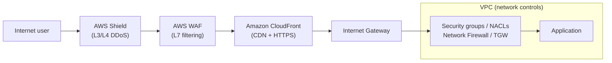
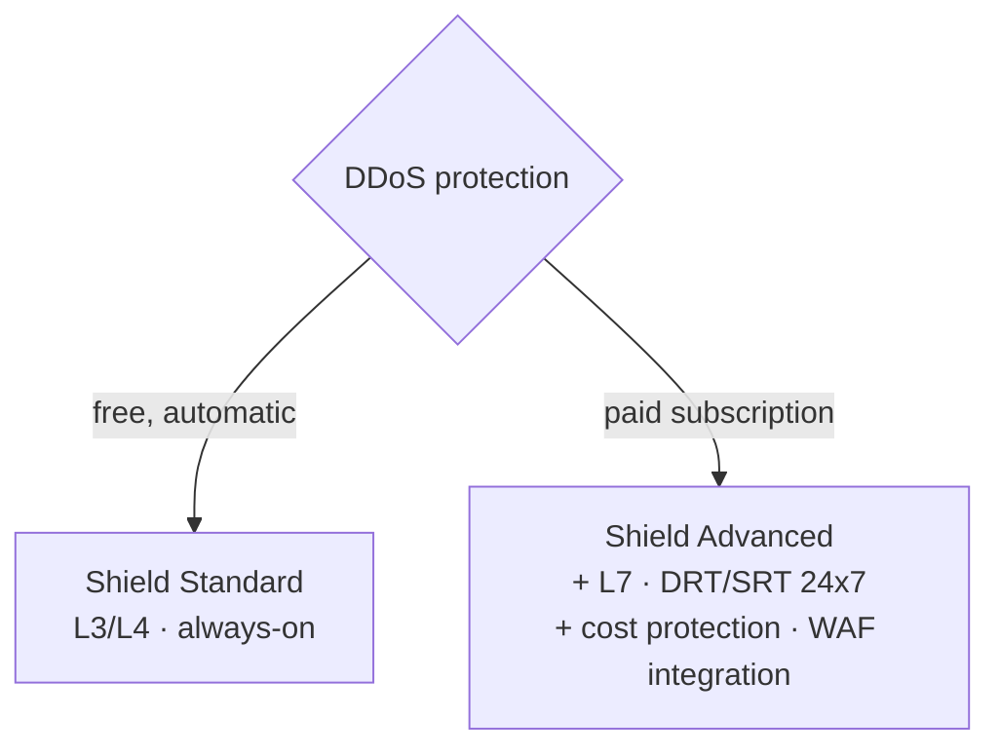

<!--
  PER-COURSE NOTES TEMPLATE
  Copy this whole folder (_TEMPLATE/) to courses/NN-short-slug/ for each new
  course or lab, then fill in the metadata block and sections below.
  This file is the SOURCE OF TRUTH for the course. After editing it, mirror the
  key metadata (Type, Points, Status, Date completed) into the tracker table in
  the root README.md and refresh the Progress Summary dashboard.
-->

# AWS Security Engineer: Edge Security

## Metadata

| Field           | Value                                                        |
| --------------- | ------------------------------------------------------------ |
| Name            | AWS Security Engineer: Edge Security                         |
| Type            | Course                                                       |
| Points          | 100 (≈1h15m)                                                 |
| Status          | In progress                                                  |
| Date completed  | —                                                            |
| Skill Builder   | https://skillbuilder.aws/learn/Q8QC4V4BMF/aws-security-engineer-edge-security/M3ZVNJGPX7 |

> Reminder: Professional recert needs **700 points total** including **at least
> 2 practical activities (labs)**. "Type = Lab" counts toward the 2-lab minimum.

## Key Takeaways

- **Edge vs. network controls** — edge controls (CloudFront, WAF, Shield) sit at
  the *perimeter* and filter internet traffic before it reaches the VPC; network
  controls (security groups, NACLs, Network Firewall, Transit Gateway) are
  *internal* checkpoints between resources.
- **Shield Standard vs. Advanced** — Standard is free/automatic and covers
  **L3/L4** DDoS; Advanced is a paid subscription adding **L7** protection, the
  DDoS Response Team, cost protection, and WAF integration.
- **WAF = L7 request filtering** — inspects HTTP/HTTPS requests and blocks OWASP
  Top 10 patterns (SQL injection, XSS) and malicious bots.
- **CloudFront is both CDN and edge security** — low-latency delivery plus HTTPS,
  field-level encryption, and geo access controls at AWS's points of presence.

## Services Covered

- **AWS Shield (Standard & Advanced)** — managed DDoS protection at the edge
  (L3/L4 always-on; L7 + DRT/cost protection with Advanced).
- **AWS WAF** — L7 web application firewall filtering HTTP/HTTPS requests
  (SQLi, XSS, bots, OWASP Top 10).
- **Amazon CloudFront** — global CDN with edge security (HTTPS, field-level
  encryption, geo restrictions).
- **Amazon Route 53 / AWS Global Accelerator** — edge-facing services protected
  by Shield.

## Diagrams

**Edge controls vs. network controls (defense in depth)**

**Shield Standard vs. Advanced**

## Screenshots

**Network controls vs. edge controls** — network controls operate *inside* the
VPC (security groups, network ACLs, AWS Network Firewall, Transit Gateway),
acting as internal barriers for east-west and north-south traffic within your
VPC boundaries.

**Edge controls** operate at the *perimeter*, where the public internet meets
your AWS environment — the first line of defense, inspecting and filtering
traffic before it reaches your VPC. Edge services like **CloudFront**, **AWS
WAF**, and **AWS Shield** protect applications from internet-based threats at
global scale via AWS's points of presence (think "border security"), while
network controls act as internal checkpoints between resources.

## Notes / Scratchpad

The AWS edge security landscape:

- **AWS Shield Standard**

  Provides free, automatic protection against common **network and transport
  layer (L3/L4)** DDoS attacks. It defends AWS services like CloudFront, Route 53,
  and Global Accelerator with **always-on detection and inline mitigation**.
  Enabled automatically at no extra charge.

- **AWS Shield Advanced**

  Premium (subscription) service offering enhanced DDoS protection against
  sophisticated **application layer (L7)** attacks. Includes real-time visibility
  into attack vectors, 24/7 access to the **DDoS Response Team (DRT/SRT)**, **cost
  protection** during attacks (absorbing scaling charges from a DDoS), and **AWS
  WAF integration** for high-value applications.

- **AWS WAF**

  Monitors and filters **HTTP/HTTPS** traffic before it reaches your
  applications, protecting them from common web exploits and malicious bots that
  could affect availability, compromise security, or consume excessive resources.
  Provides customizable security rules to inspect web requests and block attack
  patterns including **SQL injection, cross-site scripting (XSS)**, and other
  **OWASP Top 10** vulnerabilities.

- **Amazon CloudFront**

  A global **content delivery network (CDN)** that securely delivers content with
  low latency, while providing robust security features including **HTTPS**,
  **field-level encryption**, and **geographic (geo) access controls**.
