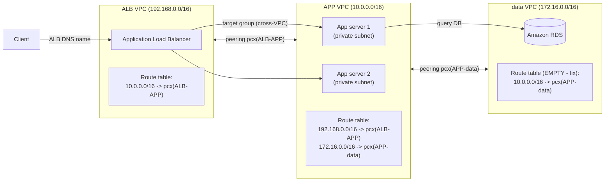

<!--
  PER-COURSE NOTES TEMPLATE
  Copy this whole folder (_TEMPLATE/) to courses/NN-short-slug/ for each new
  course or lab, then fill in the metadata block and sections below.
  This file is the SOURCE OF TRUTH for the course. After editing it, mirror the
  key metadata (Type, Points, Status, Date completed) into the tracker table in
  the root README.md and refresh the Progress Summary dashboard.
-->

# AWS SimuLearn: Resolve VPC Routing Conflicts

## Metadata

| Field           | Value                                                        |
| --------------- | ------------------------------------------------------------ |
| Name            | AWS SimuLearn: Resolve VPC Routing Conflicts                 |
| Type            | Lab (practical activity)                                     |
| Points          | 100 (≈1h)                                                    |
| Status          | In progress                                                  |
| Date completed  | —                                                            |
| Skill Builder   | <paste the course/lab URL>                                   |

> Reminder: Professional recert needs **700 points total** including **at least
> 2 practical activities (labs)**. "Type = Lab" counts toward the 2-lab minimum.

## Key Takeaways

- **VPC peering needs routes on both sides** — a peering connection only enables
  the link; each VPC's route table must send the other VPC's CIDR to the peering
  connection (`pcx`) or traffic won't flow.
- **This lab spans three VPCs / two peerings** — ALB VPC ↔ APP VPC (ALB reaches
  app servers) and APP VPC ↔ data VPC (app servers reach RDS). Each flow needs a
  route **and** its return route.
- **Peering is not transitive** — the ALB VPC can't reach the data VPC "through"
  the APP VPC; each pair needs its own peering + routes.
- **A subnet "receives" ALB traffic via routing + security groups** — the app
  subnet's route table needs the return route to the ALB VPC CIDR, and the app
  server's SG must allow the ALB (app + health-check ports) or targets stay
  unhealthy.
- **Validate with the ALB DNS name** — hitting the ALB DNS should reach the app
  servers once target group + cross-VPC routing + SGs are correct.

## Services Covered

- **Amazon VPC (peering + route tables)** — two peering connections (ALB↔APP,
  APP↔data); add routes so traffic crosses each peering in both directions.
- **Elastic Load Balancing (Application Load Balancer)** — ALB in the ALB VPC
  with a target group of app servers in the peered APP VPC; validated via ALB DNS.
- **Amazon EC2 (application servers)** — App server 1 & 2 in the APP VPC private
  subnets; the ALB target group members.
- **Amazon RDS** — database tier in the data VPC, reached by the app servers over
  the APP↔data peering.

## Diagrams

**Three VPCs (ALB ↔ APP ↔ data) over two VPC peering connections**

**Routing needed (both directions per flow):**

| Flow | Route | On route table of |
| --- | --- | --- |
| ALB → app servers | `10.0.0.0/16 → pcx(ALB-APP)` | ALB VPC |
| app servers → ALB (replies) | `192.168.0.0/16 → pcx(ALB-APP)` | APP VPC |
| app servers → RDS | `172.16.0.0/16 → pcx(APP-data)` | APP VPC |
| RDS → app servers (replies) | `10.0.0.0/16 → pcx(APP-data)` | data VPC ← **empty in the lab, add this** |

## Screenshots

**Lab problem architecture** — three VPCs. The **ALB VPC** (`192.168.0.0/16`)
runs the Application Load Balancer (round-robin to targets); the **APP VPC**
(`10.0.0.0/16`) holds App server 1 & 2 in private subnets; the **data VPC**
(`172.16.0.0/16`) holds Amazon RDS. VPC peering links ALB VPC ↔ APP VPC and
APP VPC ↔ data VPC. The **red-highlighted route tables** are the problem: the
ALB VPC route table needs the peering routes, and the data VPC route table is
**empty** (missing the routes back), so traffic can't cross the peering.

## Notes / Scratchpad

**Lab log**

- **Objective:** get an **Application Load Balancer** in one VPC (the *ALB VPC*)
  to reach **application servers** in a second VPC (the *APP VPC*) that are
  connected by **VPC peering**, then validate access via the ALB's DNS name.
- **Scenario (problem):** three VPCs — **ALB VPC** (`192.168.0.0/16`), **APP VPC**
  (`10.0.0.0/16`) with App server 1 & 2, and **data VPC** (`172.16.0.0/16`) with
  Amazon RDS — connected by two peerings (ALB↔APP, APP↔data). Traffic can't flow
  because: the ALB **target group** doesn't include the app servers, and the
  **route tables** are wrong/missing — notably the **data VPC route table is
  empty**, so app↔RDS can't cross the peering.
- **Steps taken:**
  1. **Reviewed connectivity** ALB → app servers (targets unhealthy/unreachable).
  2. **Updated the ALB target group** to register App server 1 & 2 (in the APP
     VPC) as targets.
  3. **Fixed the route tables** so each flow works in **both** directions:
     - ALB VPC: `10.0.0.0/16 → pcx(ALB-APP)`
     - APP VPC: `192.168.0.0/16 → pcx(ALB-APP)` (return to ALB) and
       `172.16.0.0/16 → pcx(APP-data)` (to RDS)
     - data VPC (was **empty**): `10.0.0.0/16 → pcx(APP-data)` (return to app servers)
  4. **How the app subnet receives ALB traffic:** its route table needs the
     return route to `192.168.0.0/16` via the peering, **and** the app server's
     **security group** must allow the ALB (app port + health-check port).
  5. **Validated** via the **ALB DNS name** — targets healthy, response returned.
- **Gotchas:**
  - Routes must exist on **both** sides of each peering; one side alone = one-way.
  - **Peering is not transitive** — ALB VPC can't reach data VPC through APP VPC.
  - The route must be on the route table **associated with the relevant subnets**.
  - **Security groups** must allow ALB → app-server traffic (health checks
    included), or targets stay unhealthy even with routing correct.
  - The **data VPC route table was empty** — the key missing piece for app↔RDS.
- **Outcome:** <fill in once completed — targets healthy, ALB DNS returns the app>

_Update the Outcome and paste the Skill Builder URL when done; I can also add a
screenshot of the healthy target group if you capture one._
