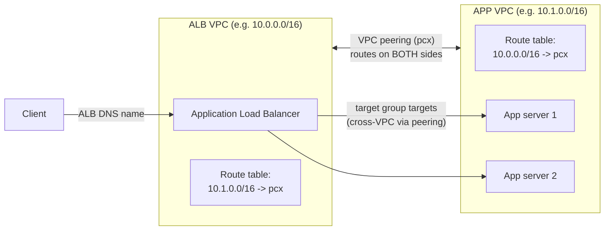

<!--
  PER-COURSE NOTES TEMPLATE
  Copy this whole folder (_TEMPLATE/) to courses/NN-short-slug/ for each new
  course or lab, then fill in the metadata block and sections below.
  This file is the SOURCE OF TRUTH for the course. After editing it, mirror the
  key metadata (Type, Points, Status, Date completed) into the tracker table in
  the root README.md and refresh the Progress Summary dashboard.
-->

# AWS SimuLearn: Resolve VPC Routing Conflicts

## Metadata

| Field           | Value                                                        |
| --------------- | ------------------------------------------------------------ |
| Name            | AWS SimuLearn: Resolve VPC Routing Conflicts                 |
| Type            | Lab (practical activity)                                     |
| Points          | 100 (≈1h)                                                    |
| Status          | In progress                                                  |
| Date completed  | —                                                            |
| Skill Builder   | <paste the course/lab URL>                                   |

> Reminder: Professional recert needs **700 points total** including **at least
> 2 practical activities (labs)**. "Type = Lab" counts toward the 2-lab minimum.

## Key Takeaways

- **VPC peering needs routes on both sides** — a peering connection only enables
  the link; each VPC's route table must send the other VPC's CIDR to the peering
  connection (`pcx`) or traffic won't flow.
- **ALB targets can live in a peered VPC** — a target group can register app
  servers in another VPC reachable over peering, as long as the routing and
  security groups allow it.
- **Validate with the ALB DNS name** — hitting the ALB's DNS name should reach the
  app servers once the target group membership + cross-VPC routing are correct.

## Services Covered

- **Amazon VPC (peering + route tables)** — connect the ALB VPC and APP VPC;
  add routes so traffic crosses the peering connection.
- **Elastic Load Balancing (Application Load Balancer)** — ALB in one VPC with a
  target group of app servers in the peered VPC; validated via the ALB DNS name.
- **Amazon EC2 (application servers)** — the backend targets registered in the
  ALB target group.

## Diagrams

**ALB VPC ↔ APP VPC over VPC peering**

## Screenshots

**Lab problem architecture** — three VPCs. The **ALB VPC** (`192.168.0.0/16`)
runs the Application Load Balancer (round-robin to targets); the **APP VPC**
(`10.0.0.0/16`) holds App server 1 & 2 in private subnets; the **data VPC**
(`172.16.0.0/16`) holds Amazon RDS. VPC peering links ALB VPC ↔ APP VPC and
APP VPC ↔ data VPC. The **red-highlighted route tables** are the problem: the
ALB VPC route table needs the peering routes, and the data VPC route table is
**empty** (missing the routes back), so traffic can't cross the peering.

## Notes / Scratchpad

**Lab log**

- **Objective:** get an **Application Load Balancer** in one VPC (the *ALB VPC*)
  to reach **application servers** in a second VPC (the *APP VPC*) that are
  connected by **VPC peering**, then validate access via the ALB's DNS name.
- **Scenario (problem):** the ALB can't reach the app servers across the peering.
  Two things are missing/wrong: the ALB **target group** doesn't include the app
  servers, and the **route tables** don't route traffic across the peering
  connection between the ALB VPC and the APP VPC.
- **Steps taken:**
  1. **Reviewed connectivity** between the ALB and the application servers to
     confirm the gap (targets unhealthy / unreachable).
  2. **Updated the ALB target group** to register the application servers in the
     APP VPC as targets.
  3. **Updated the route tables** so traffic crosses the peering connection —
     added the remote VPC's CIDR → the peering connection (`pcx`) on **both**
     sides (ALB VPC → APP VPC CIDR, and APP VPC → ALB VPC CIDR).
  4. **Validated** by hitting the **ALB DNS name** and confirming it reaches the
     application servers (targets healthy, response returned).
- **Gotchas:**
  - VPC peering routes must exist on **both** route tables — one side alone gives
    one-way/no connectivity.
  - The route must be on the route table **associated with the relevant subnets**
    (ALB subnets and app-server subnets).
  - **Security groups** must allow the ALB → app-server traffic across the peer
    CIDR (health checks included), or targets stay unhealthy even with routing
    correct.
- **Outcome:** <fill in once completed — targets healthy, ALB DNS returns the app>

_Update the Outcome and paste the Skill Builder URL when done; I can also add a
screenshot of the healthy target group if you capture one._
