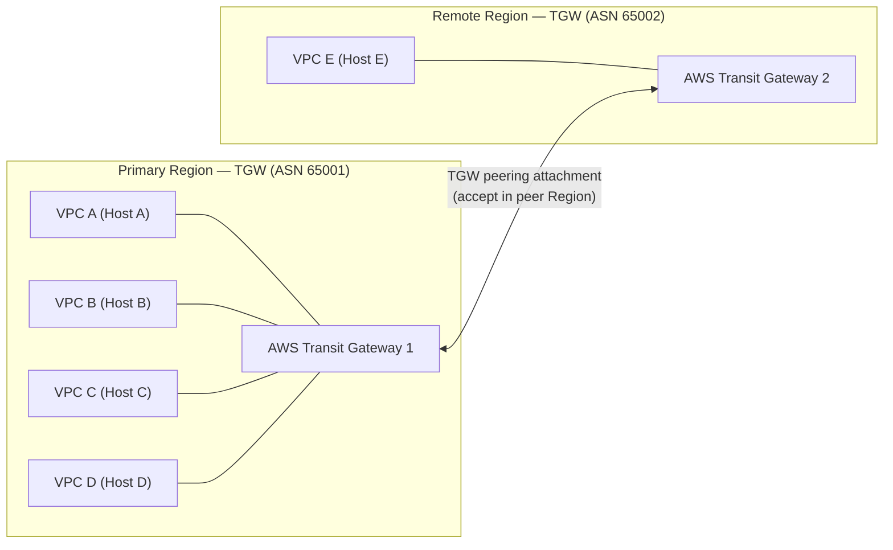
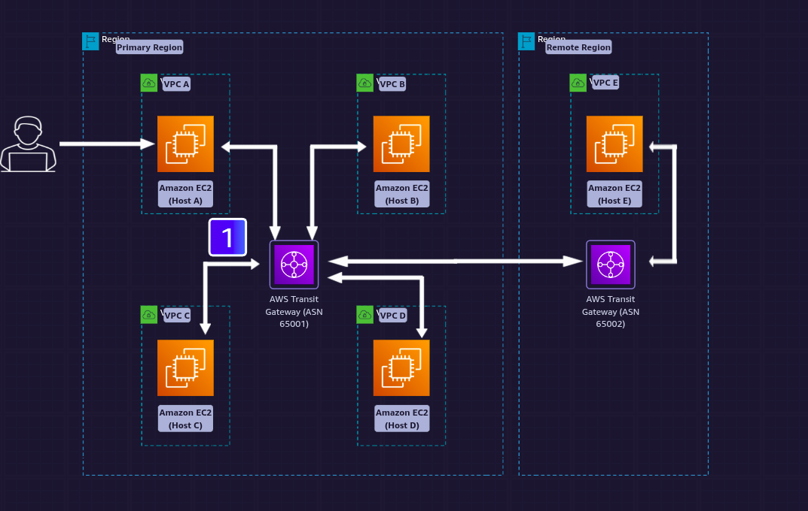

<!--
  PER-COURSE NOTES TEMPLATE
  Copy this whole folder (_TEMPLATE/) to courses/NN-short-slug/ for each new
  course or lab, then fill in the metadata block and sections below.
  This file is the SOURCE OF TRUTH for the course. After editing it, mirror the
  key metadata (Type, Points, Status, Date completed) into the tracker table in
  the root README.md and refresh the Progress Summary dashboard.
-->

# AWS SimuLearn: Inter-Region Peering

## Metadata

| Field           | Value                                                        |
| --------------- | ------------------------------------------------------------ |
| Name            | AWS SimuLearn: Inter-Region Peering                          |
| Type            | Lab (practical activity)                                     |
| Points          | 100 (≈1h)                                                    |
| Status          | In progress                                                  |
| Date completed  | —                                                            |
| Skill Builder   | <paste the course/lab URL>                                   |

> Reminder: Professional recert needs **700 points total** including **at least
> 2 practical activities (labs)**. "Type = Lab" counts toward the 2-lab minimum.

## Key Takeaways

- **TGW inter-region peering = attachment + routes** — peer two Regions' Transit
  Gateways via a **peering attachment** (accept it in the peer Region), then add
  route table entries pointing the other Region's CIDRs at that attachment.
- **Routes needed on both Regions' TGW route tables** — symmetric, or traffic is
  one-way.
- **Blackhole routes explicitly drop traffic** — add a blackhole route for
  selected subnets/CIDRs to deny them; a more-specific blackhole overrides a
  broader allow (longest-prefix match still applies).

## Services Covered

- **AWS Transit Gateway (inter-Region peering)** — peering attachment between the
  primary and remote Region TGWs; TGW route tables carry cross-Region routes.
- **Amazon VPC** — VPCs attached to each Region's TGW; their CIDRs are what the
  cross-Region and blackhole routes target.

## Diagrams

**Inter-Region Transit Gateway peering**



> Routing: each Region's TGW route table needs the **other Region's CIDRs → the
> peering attachment**. Add **blackhole routes** for any subnets/CIDRs that must
> be explicitly **denied**.

**Blackhole route example** — a more-specific blackhole carves a "deny hole" out
of a broader allow (longest-prefix match wins):

```text
Primary Region TGW route table
  Destination      Target                     Effect
  10.1.0.0/16      tgw-peering-attachment     ALLOW — reach the remote Region
  10.1.5.0/24      blackhole                  DENY  — traffic to this subnet is dropped

Result: all of 10.1.0.0/16 is reachable across the peering EXCEPT 10.1.5.0/24,
whose packets are silently discarded (the /24 blackhole beats the /16 allow).
```

**Requester vs. accepter (who accepts the peering attachment).** The **primary
TGW in us-east-1 already existed**; from it you **created** a peering attachment
targeting the **remote TGW in Oregon (us-west-2)**. The peer Region (Oregon)
must **accept** it — you accept in whichever Region did *not* create the request:

```text
   PRIMARY (us-east-1)                         REMOTE (Oregon / us-west-2)
   TGW (ASN 65001) [already existed]           TGW (ASN 65002)
        |                                            |
        |  1. CREATE peering attachment ───────────► |  2. request arrives
        |     (requester = us-east-1)                |     state: pendingAcceptance
        |                                            |
        |                                            |  3. ACCEPT here  ◄── accept
        |                                            |     in the PEER region (Oregon)
        |◄════════ peering attachment: available ═══►|
        |                                            |
   4. route: Oregon CIDRs -> attachment        4. route: us-east-1 CIDRs -> attachment
        (both TGW route tables need routes; add blackhole routes to deny subnets)

Rule: accept in the Region that did NOT create the request.
Here the request came from us-east-1, so Oregon (remote) accepts.
```

**Association vs. routes (TGW route table).** Two separate things:

- **Association** = "traffic arriving *on this attachment* is evaluated against
  *this* TGW route table." Each attachment associates with **exactly one** route
  table; a route table can have **many** attachments associated with it.
- **Routes** = the actual entries in that table (`destination → attachment`, or
  `blackhole`). Association wires the attachment in; routes do the forwarding.

In **Oregon** there was **already an association** — the local **VPC E**
attachment was associated with Oregon's TGW route table. You then associated the
**peering attachment** with that **same** route table, so one Oregon route table
now handles **both** the local VPC and the cross-Region peering traffic:

```text
Oregon TGW route table (ONE table, MANY attachments)
  Associations:
    - VPC E attachment        (was already there)
    - peering attachment      (you added this)
  Routes:
    - <VPC E CIDR>      -> VPC E attachment     (reach Host E locally)
    - <us-east-1 CIDRs> -> peering attachment   (reach the primary Region)
    - <deny subnets>    -> blackhole            (explicit deny)
```

- The pre-existing VPC E association didn't block anything — a route table holds
  **many** attachments; you just added the peering attachment as another one.
- Association alone forwards nothing — the **route entries** above still must be
  present, and the **us-east-1 side must mirror** them (its peering attachment
  associated with its TGW route table + the reverse routes).
- Use **separate** TGW route tables only if you want **segmentation** (some
  attachments must not reach others); one shared table = full connectivity.

## Screenshots

**Lab architecture** — two AWS Regions. The **Primary Region** has a Transit
Gateway (**ASN 65001**) with VPC A/B/C/D (Hosts A–D); the **Remote Region** has a
Transit Gateway (**ASN 65002**) with VPC E (Host E). The two TGWs are connected by
an **inter-Region peering attachment**, and the TGW route tables carry the
cross-Region routes (plus any blackhole routes).



## Notes / Scratchpad

**Lab log**

- **Objective:** connect two AWS Regions by peering their **Transit Gateways**,
  then fix routing so traffic flows between regions — and use **blackhole routes**
  to explicitly deny selected subnets.
- **Scenario (problem):** a **primary Region** and a **remote Region**, each with
  a Transit Gateway, need inter-region connectivity. Without a TGW **peering
  attachment** and the corresponding **route table entries**, traffic can't cross
  regions.
- **Solution request (from the lab):**
  - Create a **peering connection between the primary Region and remote Region
    transit gateways**.
  - **Update the route tables** so each region routes the other region's CIDRs to
    the TGW peering attachment.
  - Create **blackhole routes** for subnets in the selected VPCs (explicitly drop
    traffic to those destinations).
- **Steps taken:**
  1. Create a **TGW peering attachment** between the two Regions' transit
     gateways; **accept** it in the peer Region.
  2. In each TGW route table, add a route: the **other Region's CIDR → the TGW
     peering attachment**.
  3. Add **blackhole routes** for the selected subnets/CIDRs so that traffic to
     them is **dropped** (deny path).
  4. Validate connectivity across Regions (and confirm blackholed subnets are
     unreachable).
- **Gotchas:**
  - TGW peering requires a **peering attachment + accept** in the peer Region,
    *then* route table entries — the attachment alone doesn't route traffic.
  - Routes are needed in **both** Regions' TGW route tables (symmetric).
  - A **blackhole route** intentionally **drops** matching traffic — use it to
    deny specific subnets; a more-specific blackhole overrides a broader allow.
- **Outcome:** <fill in once completed>

_Paste the Skill Builder URL and any screenshots when handy._
