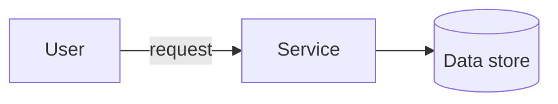

<!--
  PER-COURSE NOTES TEMPLATE
  Copy this whole folder (_TEMPLATE/) to courses/NN-short-slug/ for each new
  course or lab, then fill in the metadata block and sections below.
  This file is the SOURCE OF TRUTH for the course. After editing it, mirror the
  key metadata (Type, Points, Status, Date completed) into the tracker table in
  the root README.md and refresh the Progress Summary dashboard.
-->

# Advanced Architecting on AWS – Online Course Supplement

## Metadata

| Field           | Value                                                        |
| --------------- | ------------------------------------------------------------ |
| Name            | Advanced Architecting on AWS – Online Course Supplement      |
| Type            | Course                                                       |
| Points          | 160 (≈2h)                                                    |
| Status          | In progress                                                  |
| Date completed  | —                                                            |
| Skill Builder   | https://skillbuilder.aws/learn/DCVNQSAWWN/advanced-architecting-on-aws-online-course-supplement/64TDHJKPZY |

> Reminder: Professional recert needs **700 points total** including **at least
> 2 practical activities (labs)**. "Type = Lab" counts toward the 2-lab minimum.

## Key Takeaways

- <Bullet the most important concepts you learned.>
- <What surprised you / what to remember for real work.>

## Services Covered

- AWS Cloudformation
- Service Catalog 
- AWD Deployment Framework

## Diagrams

Prefer inline Mermaid for architecture/flow (version-control friendly). Example:



## Screenshots

**Starting-point architecture** — a multi-AZ, 3-tier web application to review and
evolve throughout the course. Edge: User → **Route 53** → **CloudFront** (with S3
**static assets**) and **Internet Gateway**. **Public subnets** (per AZ): **NAT
gateways** and an **Application Load Balancer**. **App subnets** (per AZ): app
servers in an **Auto Scaling group**, **Amazon EFS** (mount target per AZ), and a
**Memcached (ElastiCache)** cluster. **Database subnets** (per AZ): **Aurora**
primary DB instance + Aurora replica.


**AWS CloudFormation StackSets** — a centralized account pushes a CloudFormation
template out to associated accounts and regions and **immediately instantiates**
the resources. Lets a **platform team push guardrails and infrastructure into
child accounts from one central account** (multi-account, multi-region).


## Notes / Scratchpad


**Module 2-Single to Multiple Accounts**
AWS CloudFormation StackSets pushes your template out to associated accounts and
regions and immediately instantiates the resources.

- **Cross-Account access** — deployment & governance tools for going from a
  single account to many:

  - **AWS CloudFormation StackSets** — deploy a stack (template) across
    **multiple accounts and regions** from a central account in one operation;
    immediately instantiates the resources. The core primitive for fan-out
    deployment.

    **How the deployment works (self-managed permissions) — two roles, in two
    places:**

    ```text
    MANAGEMENT / ADMIN ACCOUNT                 TARGET / MEMBER ACCOUNT
    (where you create the StackSet)            (where resources are created)

    [You] create StackSet
         |
         v
    +----------------------------------+       +----------------------------------+
    | AWSCloudFormationStackSet        |       | AWSCloudFormationStackSet        |
    | AdministrationRole               | ====> | ExecutionRole                    |
    | (MUST exist in admin account)    |assumes| (MUST exist in EACH member acct) |
    |  - assumed by CloudFormation     |       |  - trusts the admin account's    |
    |  - sts:AssumeRole into members   |       |    AdministrationRole            |
    +----------------------------------+       |  - has permissions to CREATE the |
                                               |    stack's resources here        |
                                               +----------------------------------+
                                                        |
                                                        v
                                               [Stack instance + resources created]

    Trust chain:  CloudFormation -> AdministrationRole (admin acct)
                  AdministrationRole --assumes--> ExecutionRole (member acct)
                  ExecutionRole --creates--> resources in the member account
    ```

    - **`AWSCloudFormationStackSetAdministrationRole`** — lives in the **admin
      (management) account**. CloudFormation assumes it; it can `sts:AssumeRole`
      into the members.
    - **`AWSCloudFormationStackSetExecutionRole`** — lives in **every target
      member account**, **trusts** the admin account's AdministrationRole, and
      holds the permissions to actually create the stack's resources.
    - Miss the ExecutionRole in a member (or its trust to the admin role) → that
      account's deployment **fails**.
    - **Service-managed model (with Organizations):** if you enable trusted
      access with Organizations, StackSets uses **service-linked/managed roles
      automatically** and can **auto-deploy to new accounts** in an OU — you don't
      create these two roles by hand.
  - **AWS Service Catalog** — a central/platform team publishes **approved,
    pre-configured products** (CloudFormation templates) as a catalog teams can
    self-service deploy — with **governance/guardrails** (who can launch what,
    with which parameters/constraints). Standardizes *what* gets deployed.
  - **AWS Deployment Framework (ADF)** — an **open-source AWS-samples** solution
    (not a managed service) that layers **CI/CD pipelines** on top of AWS
    Organizations + CloudFormation (StackSets) to orchestrate **multi-account,
    multi-region deployments** with staged rollouts and approvals. Adds *pipeline
    automation* on top of the StackSets primitive.

  > How they relate: **StackSets** = the deployment mechanism (fan-out);
  > **Service Catalog** = governed, self-service product distribution;
  > **ADF** = CI/CD orchestration/pipelines across the org.

- **AWS Organizations** — five features to securely launch and run multi-account
  environments:

  - **Create security OUs and accounts** — organize accounts into
    **organizational units (OUs)** (e.g., a security OU) for structured
    management.
  - **Enable security services & delegate administrators** — turn on org-wide
    security services (GuardDuty, Security Hub, etc.) and **delegate admin** to a
    dedicated account instead of the management account.

    **Enable security services for the organization** — activating a security
    service **for the organization** activates it **across all accounts**
    automatically. Examples: **Amazon GuardDuty**, **Amazon Macie**, **IAM Access
    Analyzer**, **AWS Firewall Manager**, **AWS Config**, and more.

    

    **Delegate administration for security services** — use a **delegated
    administrator** to assign security-tooling ownership to a dedicated account
    (e.g., **SecurityToolingProd**). The **management account** delegates admin to
    that account, so the **security team manages the services on behalf of the
    whole organization** — and the management account isn't used for day-to-day
    security operations (best practice).

    
  - **Deploy resources across multiple accounts** — e.g., via CloudFormation
    StackSets (the cross-account deployment primitive above).
  - **Enforce controls with Organizations policies** — **Service Control
    Policies (SCPs)** and other org policies set guardrails on what accounts/OUs
    can do.

    **SCP — what/why/when:** an SCP is a **guardrail** that sets the **maximum
    permissions** (permission *boundary*) for accounts in an OU/org. It does
    **not grant** access — it only **limits** what IAM identities in those
    accounts can do. An action is allowed only if **both** the SCP *and* the
    IAM policy allow it (intersection). Applies to member accounts; the
    management account is **not** restricted by SCPs.

    - **Why:** enforce org-wide guardrails that individual account admins
      **cannot override** (e.g., prevent disabling security controls, block
      certain regions/services).
    - **When:** use SCPs (over per-account IAM) when you need a control that must
      hold across many accounts regardless of local IAM — compliance/security
      boundaries.

    **Example — deny disabling CloudTrail and restrict to allowed regions:**

    ```json
    {
      "Version": "2012-10-17",
      "Statement": [
        {
          "Sid": "DenyStoppingCloudTrail",
          "Effect": "Deny",
          "Action": ["cloudtrail:StopLogging", "cloudtrail:DeleteTrail"],
          "Resource": "*"
        },
        {
          "Sid": "DenyOutsideAllowedRegions",
          "Effect": "Deny",
          "NotAction": ["iam:*", "organizations:*", "cloudfront:*", "route53:*"],
          "Resource": "*",
          "Condition": {
            "StringNotEquals": { "aws:RequestedRegion": ["us-east-1", "us-west-2"] }
          }
        }
      ]
    }
    ```

    - Statement 1: no one in the affected accounts can **stop/delete CloudTrail**
      (protects the audit trail) — even account admins.
    - Statement 2: **region restriction** — denies actions outside `us-east-1` /
      `us-west-2`, while excluding **global services** (IAM, Organizations,
      CloudFront, Route 53) that operate in `us-east-1`.
  - **Manage access** — centralized access management (pairs with IAM Identity
    Center below).

    **ABAC (attribute-based access control) — supported:** grant access based on
    **tags/attributes** rather than static per-resource policies. You write one
    policy that says "allow if the principal's tag matches the resource's tag"
    (e.g., `aws:PrincipalTag/Project == aws:ResourceTag/Project`).

    - **With Organizations/IAM Identity Center:** identity attributes (from the
      IdP / Identity Center) flow through as **session tags**, so ABAC scales
      across accounts — new resources/teams need **no new policies**, just the
      right tags.
    - **Why ABAC vs RBAC:** RBAC needs a new role/policy per team/project; ABAC
      scales by tagging, which is ideal for large multi-account orgs with many
      teams. Requires disciplined, enforced tagging (can be mandated via SCPs /
      tag policies).

  - **AWS Backup + Organizations (cross-account/central backup)** — when AWS
    Backup is integrated with Organizations, a delegated **backup admin** account
    can centrally govern backups across the whole org:
    - **Backup policies** (an Organizations policy type) are authored centrally
      and **applied to OUs/accounts** — member accounts automatically get the
      backup plans/rules (schedules, retention, lifecycle) without per-account
      setup.
    - **Cross-account backup** — copy backups into a separate, locked-down
      **backup account/vault** for isolation (ransomware/insider resilience);
      combine with **Vault Lock** (WORM) for immutability.
    - **Central monitoring** of backup/restore across accounts.
    - Why: enforce **org-wide backup compliance** and keep recovery data outside
      the accounts that could be compromised — the same "central governance,
      delegated admin" pattern as the security services above.


- AWS Iam Identity Center


- AWS Control Tower
