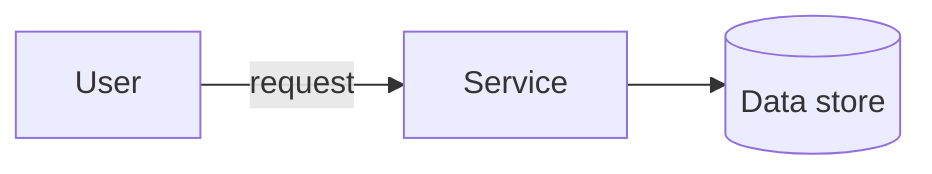

<!--
  PER-COURSE NOTES TEMPLATE
  Copy this whole folder (_TEMPLATE/) to courses/NN-short-slug/ for each new
  course or lab, then fill in the metadata block and sections below.
  This file is the SOURCE OF TRUTH for the course. After editing it, mirror the
  key metadata (Type, Points, Status, Date completed) into the tracker table in
  the root README.md and refresh the Progress Summary dashboard.
-->

# Advanced Architecting on AWS – Online Course Supplement

## Metadata

| Field           | Value                                                        |
| --------------- | ------------------------------------------------------------ |
| Name            | Advanced Architecting on AWS – Online Course Supplement      |
| Type            | Course                                                       |
| Points          | 160 (≈2h)                                                    |
| Status          | In progress                                                  |
| Date completed  | —                                                            |
| Skill Builder   | https://skillbuilder.aws/learn/DCVNQSAWWN/advanced-architecting-on-aws-online-course-supplement/64TDHJKPZY |

> Reminder: Professional recert needs **700 points total** including **at least
> 2 practical activities (labs)**. "Type = Lab" counts toward the 2-lab minimum.

## Key Takeaways

- <Bullet the most important concepts you learned.>
- <What surprised you / what to remember for real work.>

## Services Covered

- AWS Cloudformation
- Service Catalog 
- AWD Deployment Framework

## Diagrams

Prefer inline Mermaid for architecture/flow (version-control friendly). Example:

## Screenshots

**Starting-point architecture** — a multi-AZ, 3-tier web application to review and
evolve throughout the course. Edge: User → **Route 53** → **CloudFront** (with S3
**static assets**) and **Internet Gateway**. **Public subnets** (per AZ): **NAT
gateways** and an **Application Load Balancer**. **App subnets** (per AZ): app
servers in an **Auto Scaling group**, **Amazon EFS** (mount target per AZ), and a
**Memcached (ElastiCache)** cluster. **Database subnets** (per AZ): **Aurora**
primary DB instance + Aurora replica.

## Notes / Scratchpad
**Module 2-Single to Multiple Accounts**

- Cross-Account access

  

- Organizations

- AWS Iam Identity Center

- AWS Control Tower
