<!--
  PER-COURSE NOTES TEMPLATE
  Copy this whole folder (_TEMPLATE/) to courses/NN-short-slug/ for each new
  course or lab, then fill in the metadata block and sections below.
  This file is the SOURCE OF TRUTH for the course. After editing it, mirror the
  key metadata (Type, Points, Status, Date completed) into the tracker table in
  the root README.md and refresh the Progress Summary dashboard.
-->

# Advanced Architecting on AWS – Online Course Supplement

## Metadata

| Field           | Value                                                        |
| --------------- | ------------------------------------------------------------ |
| Name            | Advanced Architecting on AWS – Online Course Supplement      |
| Type            | Course                                                       |
| Points          | 160 (≈2h)                                                    |
| Status          | In progress                                                  |
| Date completed  | —                                                            |
| Skill Builder   | https://skillbuilder.aws/learn/DCVNQSAWWN/advanced-architecting-on-aws-online-course-supplement/64TDHJKPZY |

> Reminder: Professional recert needs **700 points total** including **at least
> 2 practical activities (labs)**. "Type = Lab" counts toward the 2-lab minimum.

## Key Takeaways

- <Bullet the most important concepts you learned.>
- <What surprised you / what to remember for real work.>

## Services Covered

- **AWS CloudFormation / StackSets** — infrastructure as code; StackSets fans a
  template out across accounts and regions.
- **AWS Service Catalog** — governed, self-service distribution of approved
  products (templates).
- **AWS Deployment Framework (ADF)** — open-source CI/CD orchestration for
  multi-account/multi-region deployments.
- **AWS Organizations** — multi-account structure (OUs), SCPs, delegated admin,
  org-wide policies.
- **AWS IAM Identity Center** *(formerly **AWS Single Sign-On / AWS SSO**)* —
  centralized workforce sign-in and permission sets across all org accounts;
  federates to external IdPs and supplies identity attributes (session tags) for
  ABAC.
- **AWS Resource Access Manager (AWS RAM)** — **share resources across accounts**
  (e.g., VPC subnets/Transit Gateways, Route 53 Resolver rules, License Manager)
  without duplicating them; works with Organizations for org-wide sharing.
- **AWS Control Tower** — landing zone / guardrails to set up and govern a
  secure multi-account environment.
- **AWS Backup** — centralized, policy-driven backup across accounts (with
  Organizations); cross-account backup vaults.
- Security services (org-wide): **GuardDuty, Macie, IAM Access Analyzer, Firewall
  Manager, Config**.

## Diagrams

Prefer inline Mermaid for architecture/flow (version-control friendly). Example:

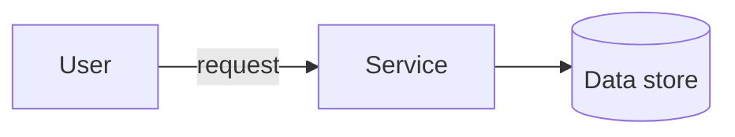

## Screenshots

**Starting-point architecture** — a multi-AZ, 3-tier web application to review and
evolve throughout the course. Edge: User → **Route 53** → **CloudFront** (with S3
**static assets**) and **Internet Gateway**. **Public subnets** (per AZ): **NAT
gateways** and an **Application Load Balancer**. **App subnets** (per AZ): app
servers in an **Auto Scaling group**, **Amazon EFS** (mount target per AZ), and a
**Memcached (ElastiCache)** cluster. **Database subnets** (per AZ): **Aurora**
primary DB instance + Aurora replica.


**AWS CloudFormation StackSets** — a centralized account pushes a CloudFormation
template out to associated accounts and regions and **immediately instantiates**
the resources. Lets a **platform team push guardrails and infrastructure into
child accounts from one central account** (multi-account, multi-region).

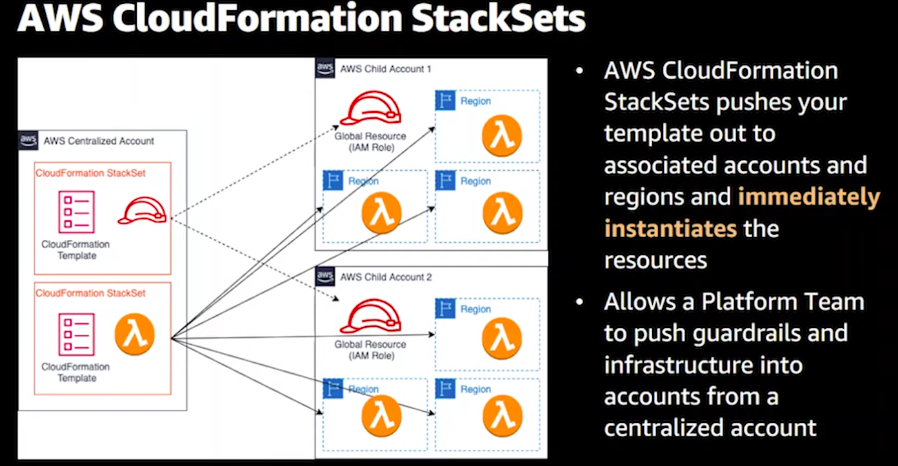

## Notes / Scratchpad


**Module 2-Single to Multiple Accounts**
AWS CloudFormation StackSets pushes your template out to associated accounts and
regions and immediately instantiates the resources.

- **Cross-Account access** — deployment & governance tools for going from a
  single account to many:

  - **AWS CloudFormation StackSets** — deploy a stack (template) across
    **multiple accounts and regions** from a central account in one operation;
    immediately instantiates the resources. The core primitive for fan-out
    deployment.

    **How the deployment works (self-managed permissions) — two roles, in two
    places:**

    ```text
    MANAGEMENT / ADMIN ACCOUNT                 TARGET / MEMBER ACCOUNT
    (where you create the StackSet)            (where resources are created)

    [You] create StackSet
         |
         v
    +----------------------------------+       +----------------------------------+
    | AWSCloudFormationStackSet        |       | AWSCloudFormationStackSet        |
    | AdministrationRole               | ====> | ExecutionRole                    |
    | (MUST exist in admin account)    |assumes| (MUST exist in EACH member acct) |
    |  - assumed by CloudFormation     |       |  - trusts the admin account's    |
    |  - sts:AssumeRole into members   |       |    AdministrationRole            |
    +----------------------------------+       |  - has permissions to CREATE the |
                                               |    stack's resources here        |
                                               +----------------------------------+
                                                        |
                                                        v
                                               [Stack instance + resources created]

    Trust chain:  CloudFormation -> AdministrationRole (admin acct)
                  AdministrationRole --assumes--> ExecutionRole (member acct)
                  ExecutionRole --creates--> resources in the member account
    ```

    - **`AWSCloudFormationStackSetAdministrationRole`** — lives in the **admin
      (management) account**. CloudFormation assumes it; it can `sts:AssumeRole`
      into the members.
    - **`AWSCloudFormationStackSetExecutionRole`** — lives in **every target
      member account**, **trusts** the admin account's AdministrationRole, and
      holds the permissions to actually create the stack's resources.
    - Miss the ExecutionRole in a member (or its trust to the admin role) → that
      account's deployment **fails**.
    - **Service-managed model (with Organizations):** if you enable trusted
      access with Organizations, StackSets uses **service-linked/managed roles
      automatically** and can **auto-deploy to new accounts** in an OU — you don't
      create these two roles by hand.

    > **CRITICAL — these are TWO separate roles in two accounts; the member does
    > NOT "use" the management account's role.** An account can only grant
    > permissions inside itself, so:
    >
    > 1. In the **management account**, CloudFormation assumes the
    >    **AdministrationRole** (that role only lets it *reach out*).
    > 2. The AdministrationRole then does **`sts:AssumeRole` across the account
    >    boundary** into the **member's OWN ExecutionRole**.
    > 3. Now operating **as the ExecutionRole *inside* the member account**,
    >    CloudFormation creates the resources there.
    >
    > The bridge is the **trust policy on the member's ExecutionRole**, whose
    > `Principal` is the **management account** ("I allow the admin account to
    > assume me"). So the admin never acts directly in the member — it
    > **crosses over by assuming a different role that lives in the member**, and
    > that member-owned role does the work. The member always controls what the
    > admin can do (via its ExecutionRole trust + permissions).

    **Setup/enablement process (self-managed) — the sequence to allow a member:**

    ```plantuml
    @startuml
    title StackSets: enable a member, then deploy (self-managed)
    actor "You (Mgmt acct)" as Admin
    participant "AdministrationRole\n(mgmt acct)" as AR
    participant "Member account" as Member
    participant "ExecutionRole\n(member acct)" as ER
    participant "CloudFormation" as CFN

    == One-time setup (to ALLOW a member) ==
    Admin -> AR : 1. Create AdministrationRole in mgmt acct
    Member -> ER : 2. Create ExecutionRole in the member acct
    Member -> ER : 3. Trust policy: Principal = mgmt account\n(allows admin to assume it)
    Member -> ER : 4. Permissions policy: create the stack's resources

    == Deploy ==
    Admin -> CFN : 5. Create StackSet + stack instances (target = member)
    CFN -> AR : 6. Assume AdministrationRole
    AR -> ER : 7. sts:AssumeRole across boundary into member's ExecutionRole
    ER -> Member : 8. Create resources in the member account
    @enduml
    ```

    

    - Steps 1–4 are the **one-time enablement** that "allows the member": the
      member must have an **ExecutionRole that trusts the management account**.
    - Steps 5–8 are the **deploy** — repeatable for any target account/region.
    - **Shortcut:** with the **service-managed** model (Organizations trusted
      access enabled), steps 1–4 are handled automatically and StackSets can even
      **auto-enroll new accounts** in a target OU.

    **What "target" means (accounts × regions):** a stack set in the
    **administrator account** fans out to **target accounts** in each selected
    **region**, creating one **stack instance** per account×region. You choose the
    targets at the *create stack instances* step (self-managed = account IDs;
    service-managed = OUs).

    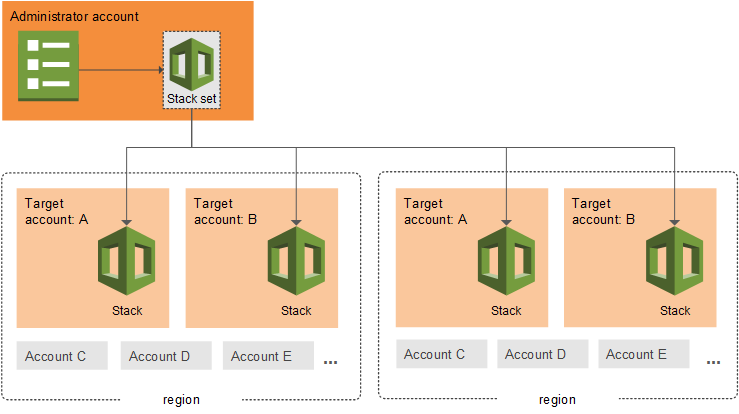

    > Image source: AWS documentation — *StackSets concepts*
    > (<https://docs.aws.amazon.com/AWSCloudFormation/latest/UserGuide/what-is-cfnstacksets.html>).
    > © Amazon Web Services; included here for study/reference with attribution.

    - Steps 1–4 are the **one-time enablement** that "allows the member": the
      member must have an **ExecutionRole that trusts the management account**.
    - Steps 5–8 are the **deploy** — repeatable for any target account/region.
    - **Shortcut:** with the **service-managed** model (Organizations trusted
      access enabled), steps 1–4 are handled automatically and StackSets can even
      **auto-enroll new accounts** in a target OU.
  - **AWS Service Catalog** — a central/platform team publishes **approved,
    pre-configured products** (CloudFormation templates) as a catalog teams can
    self-service deploy — with **governance/guardrails** (who can launch what,
    with which parameters/constraints). Standardizes *what* gets deployed.
  - **AWS Deployment Framework (ADF)** — an **open-source AWS-samples** solution
    (not a managed service) that layers **CI/CD pipelines** on top of AWS
    Organizations + CloudFormation (StackSets) to orchestrate **multi-account,
    multi-region deployments** with staged rollouts and approvals. Adds *pipeline
    automation* on top of the StackSets primitive.

  > How they relate: **StackSets** = the deployment mechanism (fan-out);
  > **Service Catalog** = governed, self-service product distribution;
  > **ADF** = CI/CD orchestration/pipelines across the org.

- **AWS Organizations** — five features to securely launch and run multi-account
  environments:

  - **Create security OUs and accounts** — organize accounts into
    **organizational units (OUs)** (e.g., a security OU) for structured
    management.
  - **Enable security services & delegate administrators** — turn on org-wide
    security services (GuardDuty, Security Hub, etc.) and **delegate admin** to a
    dedicated account instead of the management account.

    **Enable security services for the organization** — activating a security
    service **for the organization** activates it **across all accounts**
    automatically. Examples: **Amazon GuardDuty**, **Amazon Macie**, **IAM Access
    Analyzer**, **AWS Firewall Manager**, **AWS Config**, and more.

    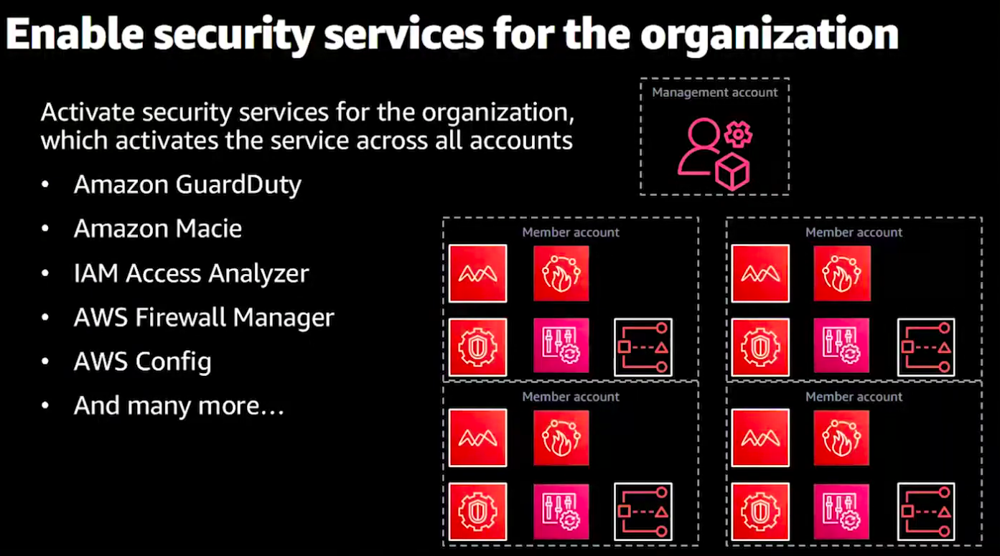

    **Delegate administration for security services** — use a **delegated
    administrator** to assign security-tooling ownership to a dedicated account
    (e.g., **SecurityToolingProd**). The **management account** delegates admin to
    that account, so the **security team manages the services on behalf of the
    whole organization** — and the management account isn't used for day-to-day
    security operations (best practice).

    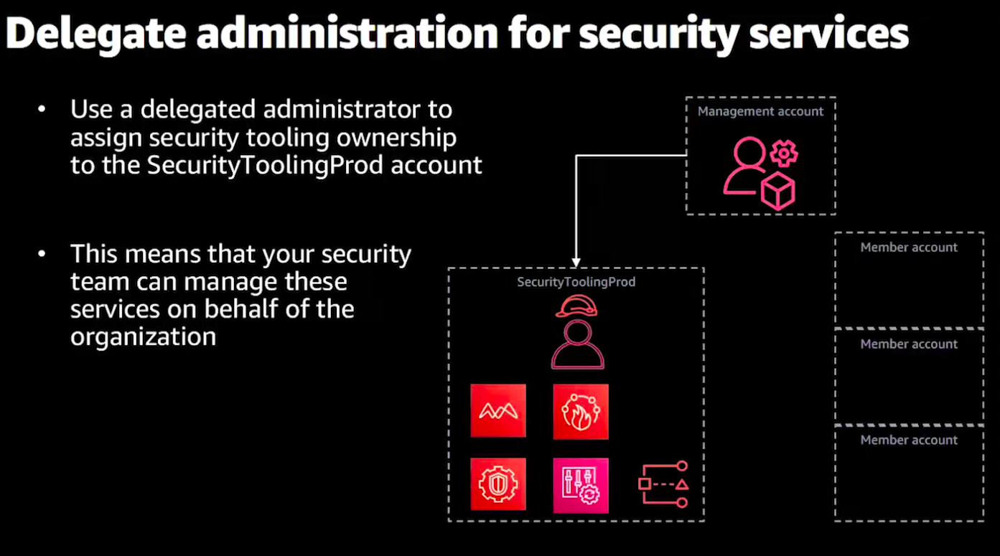
  - **Deploy resources across multiple accounts** — e.g., via CloudFormation
    StackSets (the cross-account deployment primitive above).
  - **Enforce controls with Organizations policies** — **Service Control
    Policies (SCPs)** and other org policies set guardrails on what accounts/OUs
    can do.

    **SCP — what/why/when:** an SCP is a **guardrail** that sets the **maximum
    permissions** (permission *boundary*) for accounts in an OU/org. It does
    **not grant** access — it only **limits** what IAM identities in those
    accounts can do. An action is allowed only if **both** the SCP *and* the
    IAM policy allow it (intersection). Applies to member accounts; the
    management account is **not** restricted by SCPs.

    - **Why:** enforce org-wide guardrails that individual account admins
      **cannot override** (e.g., prevent disabling security controls, block
      certain regions/services).
    - **When:** use SCPs (over per-account IAM) when you need a control that must
      hold across many accounts regardless of local IAM — compliance/security
      boundaries.

    **Example — deny disabling CloudTrail and restrict to allowed regions:**

    ```json
    {
      "Version": "2012-10-17",
      "Statement": [
        {
          "Sid": "DenyStoppingCloudTrail",
          "Effect": "Deny",
          "Action": ["cloudtrail:StopLogging", "cloudtrail:DeleteTrail"],
          "Resource": "*"
        },
        {
          "Sid": "DenyOutsideAllowedRegions",
          "Effect": "Deny",
          "NotAction": ["iam:*", "organizations:*", "cloudfront:*", "route53:*"],
          "Resource": "*",
          "Condition": {
            "StringNotEquals": { "aws:RequestedRegion": ["us-east-1", "us-west-2"] }
          }
        }
      ]
    }
    ```

    - Statement 1: no one in the affected accounts can **stop/delete CloudTrail**
      (protects the audit trail) — even account admins.
    - Statement 2: **region restriction** — denies actions outside `us-east-1` /
      `us-west-2`, while excluding **global services** (IAM, Organizations,
      CloudFront, Route 53) that operate in `us-east-1`.
  - **Manage access** — centralized access management (pairs with IAM Identity
    Center below).

    **ABAC (attribute-based access control) — supported:** grant access based on
    **tags/attributes** rather than static per-resource policies. You write one
    policy that says "allow if the principal's tag matches the resource's tag"
    (e.g., `aws:PrincipalTag/Project == aws:ResourceTag/Project`).

    - **With Organizations/IAM Identity Center:** identity attributes (from the
      IdP / Identity Center) flow through as **session tags**, so ABAC scales
      across accounts — new resources/teams need **no new policies**, just the
      right tags.
    - **Why ABAC vs RBAC:** RBAC needs a new role/policy per team/project; ABAC
      scales by tagging, which is ideal for large multi-account orgs with many
      teams. Requires disciplined, enforced tagging (can be mandated via SCPs /
      tag policies).

  - **AWS Backup + Organizations (cross-account/central backup)** — when AWS
    Backup is integrated with Organizations, a delegated **backup admin** account
    can centrally govern backups across the whole org:
    - **Backup policies** (an Organizations policy type) are authored centrally
      and **applied to OUs/accounts** — member accounts automatically get the
      backup plans/rules (schedules, retention, lifecycle) without per-account
      setup.
    - **Cross-account backup** — copy backups into a separate, locked-down
      **backup account/vault** for isolation (ransomware/insider resilience);
      combine with **Vault Lock** (WORM) for immutability.
    - **Central monitoring** of backup/restore across accounts.
    - Why: enforce **org-wide backup compliance** and keep recovery data outside
      the accounts that could be compromised — the same "central governance,
      delegated admin" pattern as the security services above.

  - **AWS Resource Access Manager (AWS RAM)** — **share resources across
    accounts** instead of duplicating them. Share things like **VPC subnets**
    (VPC sharing), **Transit Gateways**, **Route 53 Resolver rules**, and
    **License Manager** configs with other accounts/OUs.
    - Works with **Organizations** to share org-wide (or to specific OUs) without
      per-resource invitations.
    - Why: reduces duplication and central-izes shared networking/infra (e.g., a
      networking account owns the TGW/subnets and shares them to app accounts).


- **AWS IAM Identity Center** *(formerly **AWS Single Sign-On / AWS SSO**)* —
  centralized **workforce sign-in** across all org accounts using **permission
  sets**; federates to an external IdP (Okta, Entra ID, etc.). Supplies identity
  **attributes as session tags**, enabling **ABAC** across accounts. The modern
  replacement for per-account IAM users for human access.


- AWS Control Tower

Set up a best-practices AWS environment in a few clicks
- Standardize account provisioning
- Centralize policy management
- Enforce governance and compliance proactively
- Enable end-user self-service

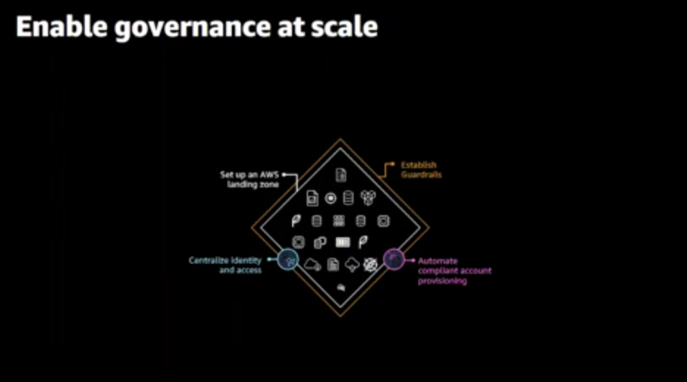

#### Hybrid Connectivity

- **AWS Site-to-Site VPN** — Establishes encrypted IPsec tunnels between your on-premises network and AWS.
    - **Components:**
        - **Customer Gateway (CGW):** The on-premises device/firewall (the VPN endpoint on your side).
        - **AWS Termination Points (Managed Service):**
            - **Virtual Private Gateway (VGW):** The *standard* AWS-side VPN endpoint for connecting to a **single VPC**.
            - **Transit Gateway (TGW):** An *optional, advanced* hub for connecting **multiple VPCs** and on-premises networks (ideal for hub-and-spoke architectures, but not mandatory).
        - **Note on EC2/ALB:**
            - **ALBs** cannot terminate Site-to-Site VPNs (they are Layer 7).
            - **EC2 Instances** can only terminate VPNs if you deploy a **custom software VPN appliance** (DIY). You are responsible for managing/scaling/HA of that instance (as opposed to the managed VGW/TGW service).
    - **High Availability:** Always provisions two tunnels; both must be configured on your CGW.
    - **Routing:** Supports Static or Dynamic (BGP) routing.
    - **NAT Traversal (NAT-T):** Essential if the CGW is behind a NAT device; encapsulates ESP in UDP/4500.

- **AWS Client VPN** — A managed, client-based remote-access VPN service.
    - **Use Case:** Individual remote access for employees/contractors to access private VPC resources from any location.
    - **How it works:**
        - User installs an OpenVPN-compatible client.
        - Establishes a secure TLS tunnel to the AWS Client VPN endpoint.
        - Authenticates via AD, SAML (Okta/Entra ID), or certificates.
    - **Association:** Client VPN endpoints are associated with one or more subnets in a VPC. When associated, an ENI is created in those subnets, allowing the Client VPN to route traffic to the VPC.
    - **Security Groups:** Attached to the Client VPN endpoint association; they control inbound traffic from the Client VPN ENIs *to* the VPC resources.
    - **Authorization Rules:** You must explicitly add authorization rules to the Client VPN endpoint to grant access to specific network segments (e.g., VPC CIDR, on-premises networks reachable via TGW/VGW).
    - **Route Table:** The Client VPN endpoint has its own route table. You must configure routes (e.g., 10.0.0.0/16 → VPC network interface) to determine where traffic is sent once it exits the VPN tunnel.

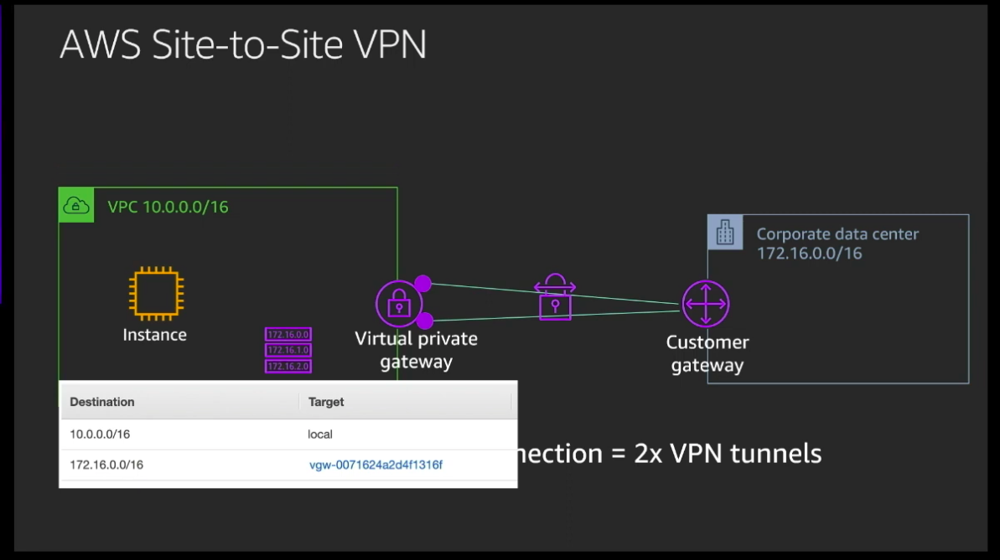

    - **Comparison:**
        - Site-to-Site = Network-to-Network (permanent, gateway-to-gateway).
        - Client VPN = User-to-Network (on-demand, client-to-gateway).

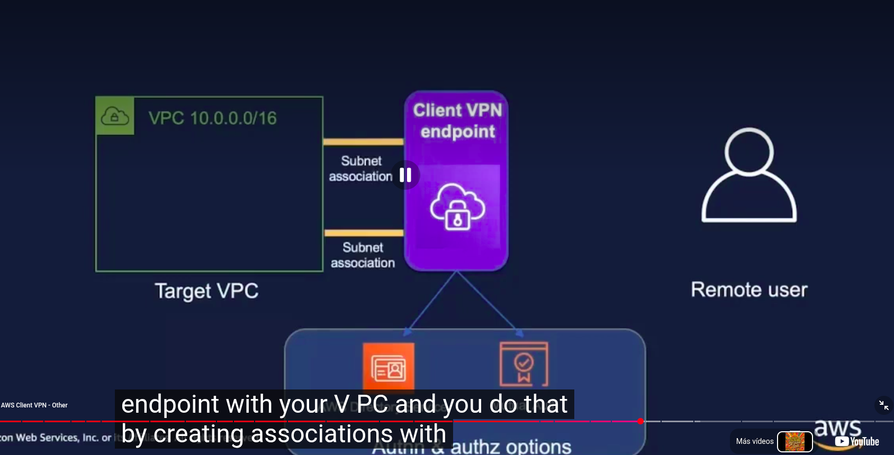

- **AWS Direct Connect (DX)** — A dedicated private network link from on-premises to AWS.
    - **Physical Endpoint:** A cross-connect at an AWS Direct Connect location.
    - **Logical Endpoints (Virtual Interfaces - VIFs):**
        - **Private VIF:** Access an Amazon VPC using private IP addresses. Connect to a Virtual Private Gateway (VGW) or a Direct Connect Gateway (DXGW).
        - **Public VIF:** Access AWS services from your on-premises data center. Allow AWS services or AWS customers access to your public networks over the interface instead of traversing the internet.
        - **Transit VIF:** Access one or more VPC Transit Gateways (TGW) associated with Direct Connect gateways. Used with 1/2/5/10/100 Gbps Direct Connect connections.
        - *Source:* [AWS Direct Connect Documentation](https://docs.aws.amazon.com/directconnect/latest/UserGuide/WorkingWithVirtualInterfaces.html)
    - **Direct Connect Gateway (DXGW):** A global construct that allows connecting a DX to VPCs across *different* regions. Essential for scaling DX in multi-region environments.
    - **Invalid Termination Points:** You cannot terminate a Direct Connect VIF directly on an **EC2 Instance**, **Load Balancer (ALB/NLB)**, **Internet Gateway**, or **NAT Gateway**. DX VIFs require a BGP session and must terminate on specialized routing constructs (VGW/DXGW).
    - **Note:** It is *not encrypted* by default. Layer a VPN or use MACsec for encryption.

- **AWS Global Accelerator** — Improves availability/performance by routing user traffic over the AWS global network via Anycast IP addresses.
    - **Use Case:** Ideal for TCP/UDP applications (non-HTTP) where network performance and fast failover are required.
    - **vs. CloudFront:** Use CloudFront for caching HTTP content; use Global Accelerator for network-level acceleration of any TCP/UDP traffic.
    - **Components:** Static Anycast IPs, endpoint groups, health checks, and traffic dials for easy traffic shifting.

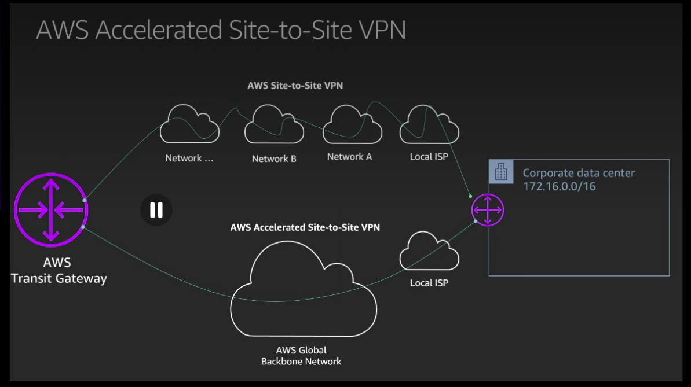

- **Route 53 Resolver (Hybrid DNS)** — Bridges DNS resolution across hybrid environments and multi-VPC setups.
    - **Private Hosted Zones (PHZs):** Associate multiple VPCs with a single PHZ to allow cross-VPC DNS resolution within AWS.
    - **Inbound Endpoints:** Allow on-premises DNS servers to forward queries to AWS Resolver.
    - **Outbound Endpoints:** Allow AWS resources to resolve on-premises DNS domains via forwarding rules.
    - **Resolution Flow:** Route 53 Resolver automatically resolves public DNS and private hosted zones. Use resolver rules to bridge to on-premises DNS (and vice-versa).

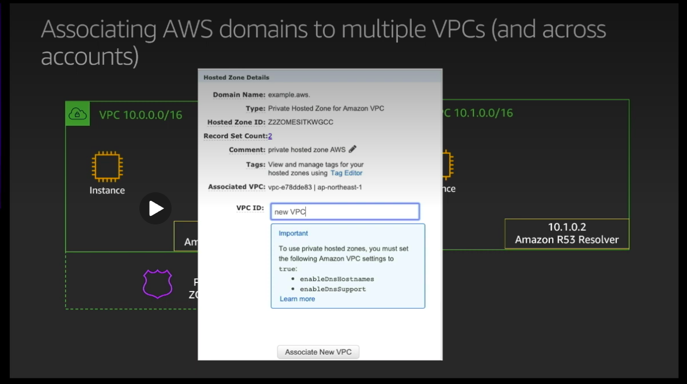


### Site-to-Site VPN Architecture


### Virtual Interface (VIF) Architecture

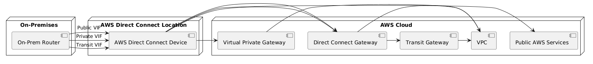


