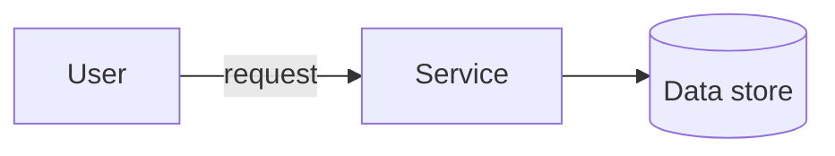

<!--
  PER-COURSE NOTES TEMPLATE
  Copy this whole folder (_TEMPLATE/) to courses/NN-short-slug/ for each new
  course or lab, then fill in the metadata block and sections below.
  This file is the SOURCE OF TRUTH for the course. After editing it, mirror the
  key metadata (Type, Points, Status, Date completed) into the tracker table in
  the root README.md and refresh the Progress Summary dashboard.
-->

# Advanced Architecting on AWS – Online Course Supplement

## Metadata

| Field           | Value                                                        |
| --------------- | ------------------------------------------------------------ |
| Name            | Advanced Architecting on AWS – Online Course Supplement      |
| Type            | Course                                                       |
| Points          | 160 (≈2h)                                                    |
| Status          | In progress                                                  |
| Date completed  | —                                                            |
| Skill Builder   | https://skillbuilder.aws/learn/DCVNQSAWWN/advanced-architecting-on-aws-online-course-supplement/64TDHJKPZY |

> Reminder: Professional recert needs **700 points total** including **at least
> 2 practical activities (labs)**. "Type = Lab" counts toward the 2-lab minimum.

## Key Takeaways

- <Bullet the most important concepts you learned.>
- <What surprised you / what to remember for real work.>

## Services Covered

- AWS Cloudformation
- Service Catalog 
- AWD Deployment Framework

## Diagrams

Prefer inline Mermaid for architecture/flow (version-control friendly). Example:

## Screenshots

**Starting-point architecture** — a multi-AZ, 3-tier web application to review and
evolve throughout the course. Edge: User → **Route 53** → **CloudFront** (with S3
**static assets**) and **Internet Gateway**. **Public subnets** (per AZ): **NAT
gateways** and an **Application Load Balancer**. **App subnets** (per AZ): app
servers in an **Auto Scaling group**, **Amazon EFS** (mount target per AZ), and a
**Memcached (ElastiCache)** cluster. **Database subnets** (per AZ): **Aurora**
primary DB instance + Aurora replica.

**AWS CloudFormation StackSets** — a centralized account pushes a CloudFormation
template out to associated accounts and regions and **immediately instantiates**
the resources. Lets a **platform team push guardrails and infrastructure into
child accounts from one central account** (multi-account, multi-region).

## Notes / Scratchpad

**Module 2-Single to Multiple Accounts**
AWS CloudFormation StackSets pushes your template out to associated accounts and
regions and immediately instantiates the resources.

- **Cross-Account access** — deployment & governance tools for going from a
  single account to many:

  - **AWS CloudFormation StackSets** — deploy a stack (template) across
    **multiple accounts and regions** from a central account in one operation;
    immediately instantiates the resources. The core primitive for fan-out
    deployment.
  - **AWS Service Catalog** — a central/platform team publishes **approved,
    pre-configured products** (CloudFormation templates) as a catalog teams can
    self-service deploy — with **governance/guardrails** (who can launch what,
    with which parameters/constraints). Standardizes *what* gets deployed.
  - **AWS Deployment Framework (ADF)** — an **open-source AWS-samples** solution
    (not a managed service) that layers **CI/CD pipelines** on top of AWS
    Organizations + CloudFormation (StackSets) to orchestrate **multi-account,
    multi-region deployments** with staged rollouts and approvals. Adds *pipeline
    automation* on top of the StackSets primitive.

  > How they relate: **StackSets** = the deployment mechanism (fan-out);
  > **Service Catalog** = governed, self-service product distribution;
  > **ADF** = CI/CD orchestration/pipelines across the org.

- **AWS Organizations** — five features to securely launch and run multi-account
  environments:

  - **Create security OUs and accounts** — organize accounts into
    **organizational units (OUs)** (e.g., a security OU) for structured
    management.
  - **Enable security services & delegate administrators** — turn on org-wide
    security services (GuardDuty, Security Hub, etc.) and **delegate admin** to a
    dedicated account instead of the management account.
  - **Deploy resources across multiple accounts** — e.g., via CloudFormation
    StackSets (the cross-account deployment primitive above).
  - **Enforce controls with Organizations policies** — **Service Control
    Policies (SCPs)** and other org policies set guardrails on what accounts/OUs
    can do.
  - **Manage access** — centralized access management (pairs with IAM Identity
    Center below).

- AWS Iam Identity Center

- AWS Control Tower
