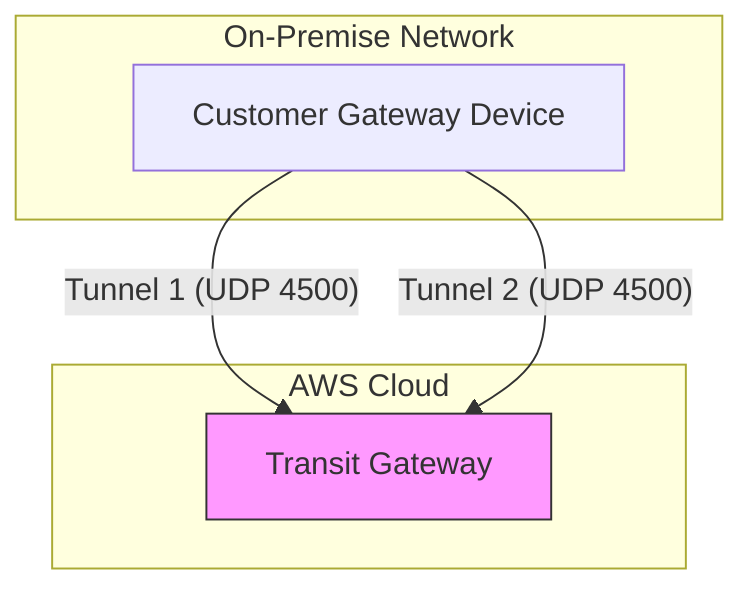

# Hybrid Connectivity — Site-to-Site VPN

## Metadata

| Field           | Value                                                        |
| --------------- | ------------------------------------------------------------ |
| Name            | Hybrid Connectivity — Site-to-Site VPN                       |
| Type            | Course / Lab                                                 |
| Points          | 50                                                           |
| Status          | In progress                                                  |
| Date completed  | —                                                            |

## Key Takeaways

- **High Availability (HA):** AWS Site-to-Site VPN *always* provisions two tunnels per connection. Both tunnels must be configured on the on-premises customer gateway device to ensure redundancy and meet the SLA.
- **Routing:** Supports **Static** or **Dynamic (BGP)** routing. BGP is preferred for Pro-level architectures to automate failover and path selection.
- **NAT Traversal (NAT-T):** Essential when the customer gateway (on-prem) is located behind a NAT device (e.g., firewall/NAT router). It encapsulates IPsec packets in UDP/4500 to pass through NAT successfully.
- **Termination Point:** VPNs terminate either on a **Virtual Private Gateway (VGW)** (for a single VPC) or a **Transit Gateway (TGW)** (for multi-VPC hub-and-spoke architectures).

## Site-to-Site VPN Deep Dive

### 1. The Two-Tunnel Requirement
AWS requires both tunnels to be configured on your Customer Gateway (CGW) device.
- **Active/Active vs. Active/Passive:** While both tunnels are *technically* active, you can use BGP attributes (AS-Path prepending, Local Preference) to influence traffic to prefer one tunnel over the other, effectively making them Active/Passive.

### 2. NAT-T (NAT Traversal)
- **Problem:** IPsec (AH/ESP protocols) typically cannot pass through NAT because the internal IP addresses are translated.
- **Solution:** NAT-T wraps the ESP packets in UDP (port 4500).
- **Pro Tip:** Ensure your firewall/NAT device allows UDP 4500 and UDP 500 (IKE).

### 3. VGW vs. TGW
- **VGW (Virtual Private Gateway):** A legacy construct for connecting a VPN directly to a single VPC.
- **TGW (Transit Gateway):** The modern, scalable hub-and-spoke approach. Connect multiple VPNs, VPCs, and DX connections to one central TGW.

## Diagrams

