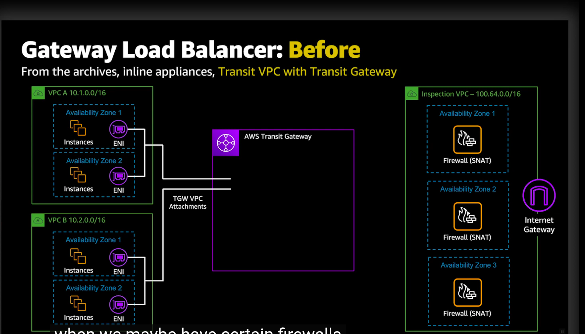
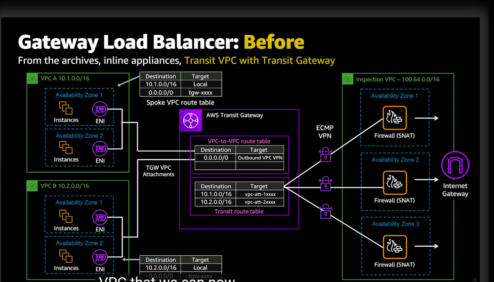
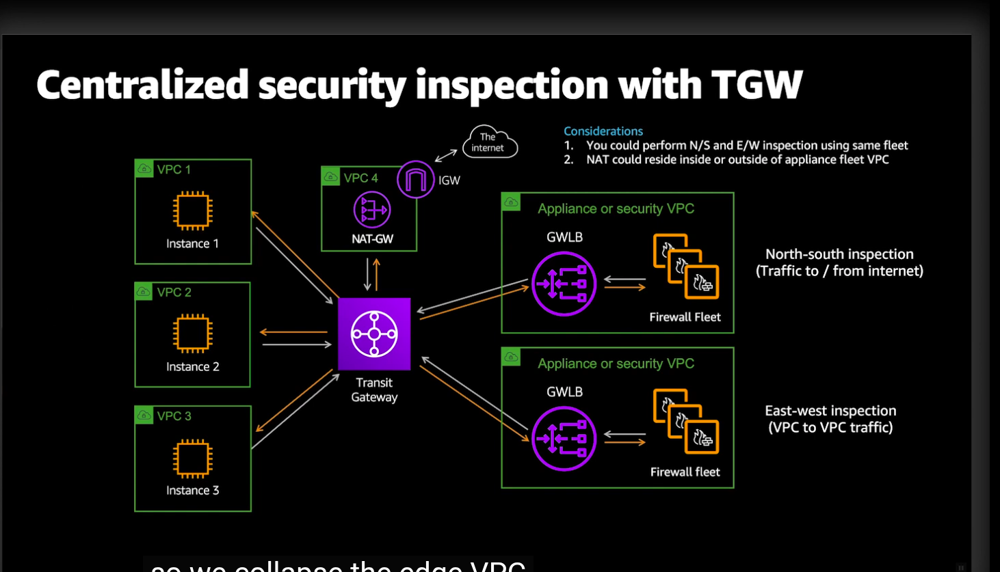
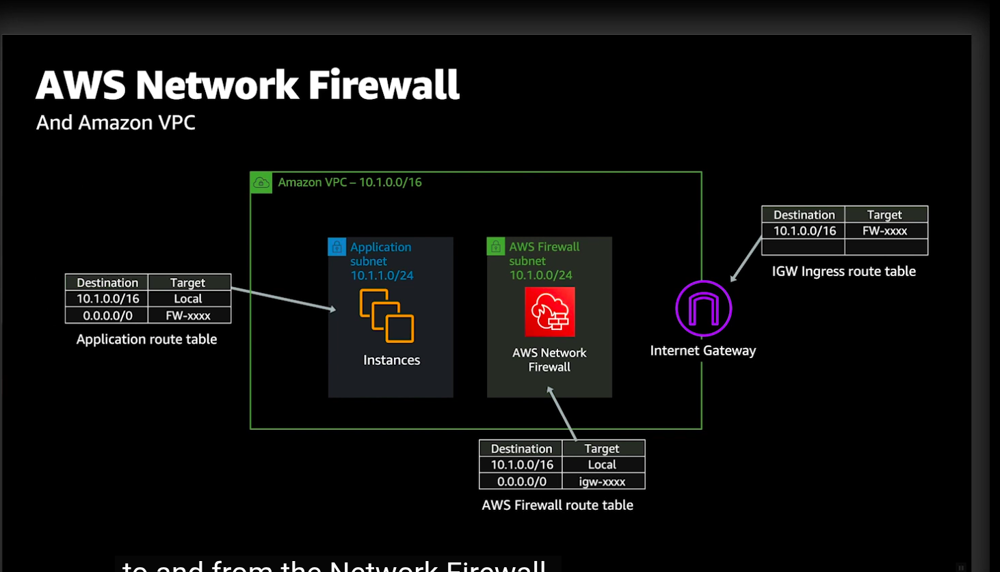
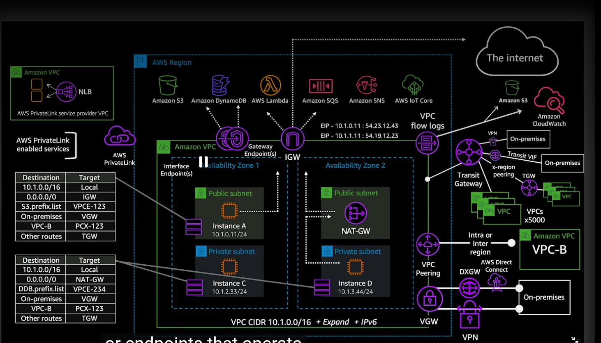
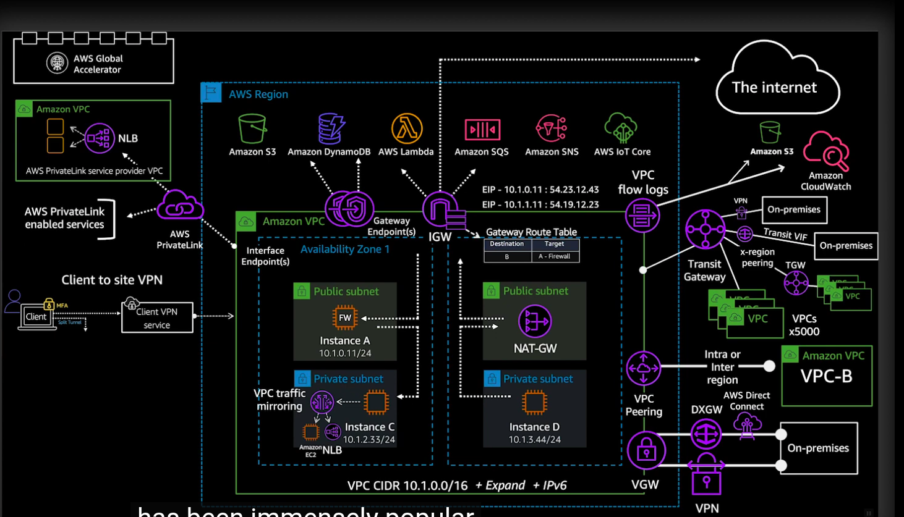
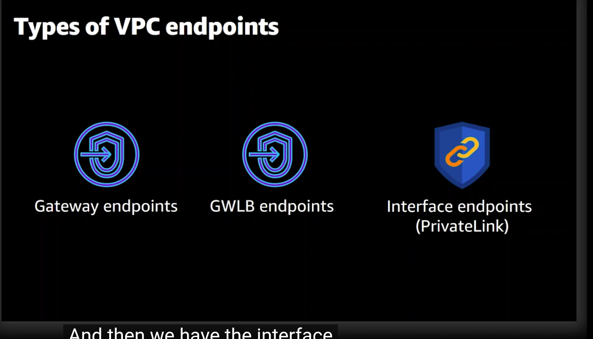
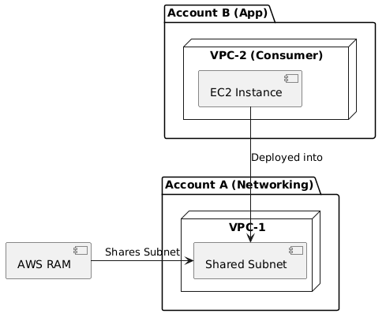
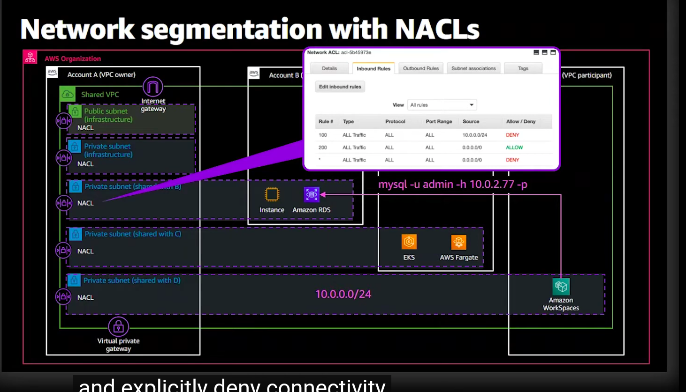
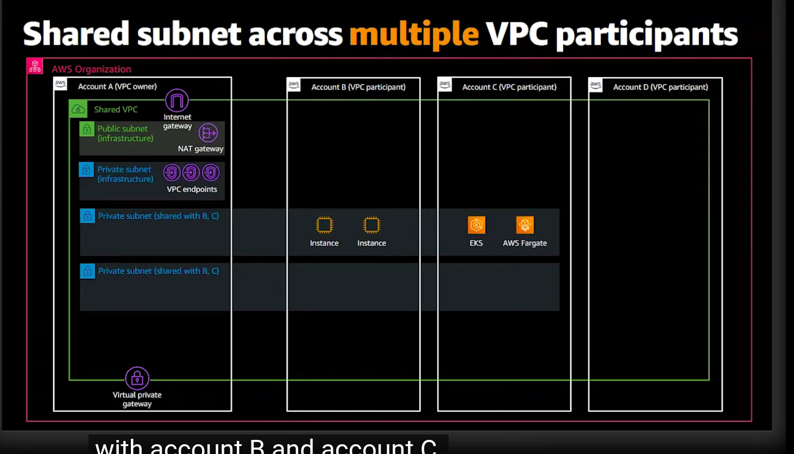

# VPC Design & New Capabilities

- **VPC Design Fundamentals:**
    - Subnets, Route Tables, Internet Gateways (IGW), NAT Gateways.
    - Security Groups (stateful) vs Network ACLs (stateless).

- **Advanced VPC Capabilities:**
    - **Gateway Load Balancer (GWLB):** Deploys, scales, and manages virtual appliances (firewalls, IDS/IPS).
        - **Core Technology:** Powered by **AWS Hyperplane**, which enables the service to scale across multiple availability zones and maintain high throughput.
        - **Capabilities:** Combines a transparent network **Layer 3 Gateway** (which routes traffic) with **Layer 4 Load Balancing** (which distributes traffic across appliances).
        - **Gateway Load Balancer Endpoint (GWLBE):** Traffic is routed to the virtual appliances via a GWLBE (a VPC endpoint specifically for GWLB).
        - **Protocol:** Uses the **GENEVE** protocol (port 6081) to encapsulate traffic between the GWLB and the virtual appliance. This allows metadata to be passed with the packets to the appliance.
        - **Use Case:** Transparently inspect and filter traffic flowing into/out of your VPC, or between VPCs.





    - **AWS Network Firewall:** A managed service for deploying essential network protections for all your VPCs.
        - **Stateful Rules:** 
            - Inspects packets in the context of traffic flow. 
            - Filters traffic based on 5-tuple (source/destination IP, port, protocol) **and** domain lists (e.g., allow/deny access to `*.example.com`).
            - *Use Case:* Advanced filtering, domain-level filtering, and intrusion prevention (IPS).
        - **Stateless Rules:**
            - Inspects each packet in isolation, without context of the connection flow.
            - Filters traffic strictly based on the 5-tuple (IP, Port, Protocol).
            - *Use Case:* High-speed, simple packet filtering (e.g., dropping all traffic from a known malicious IP).
        - **Step-by-Step Configuration:**
            1. **Inspection VPC Setup:** Deploy Network Firewall in dedicated subnets. Modify the **Internet Gateway (IGW) Route Table** to route traffic destined for App VPCs to the **Firewall Endpoint ENI**.
            2. **Transit Gateway (TGW) Routing:** 
               - **App VPCs:** Route tables must point `0.0.0.0/0` to the **TGW**.
               - **TGW Route Table (App VPCs):** Add a static route `0.0.0.0/0` pointing to the **Inspection VPC Attachment**. This "steers" all outbound traffic through the firewall.
               - **TGW Route Table (Inspection VPC):** Add routes to each **App VPC CIDR** pointing to the respective **App VPC Attachments** for return traffic.
            3. **Symmetry:** Ensure all route tables are configured symmetrically to prevent the firewall from dropping return traffic due to state mismatches.

```text
       [Internet]
            |
    [VPC: Inspection] 
    (1) Firewall Endpoint <--- [Gateway Load Balancer]
            |
    [Transit Gateway] (The routing hub)
            |
    +-------+-------+
    |               |
[VPC: App1]   [VPC: App2]
```

### Flow: VPC to Network Firewall via TGW
To route traffic from a VPC through the Network Firewall (in an Inspection VPC) using Transit Gateway, follow this path:
1. **App VPC Route Table:** Route `0.0.0.0/0` (or target CIDR) -> **Transit Gateway (TGW)**.
2. **TGW Route Table (for App VPCs):** Route `0.0.0.0/0` -> **Inspection VPC Attachment**.
3. **Inspection VPC Route Table:** Route `0.0.0.0/0` (or target CIDR) -> **Network Firewall Endpoint (ENI)**.
4. **Network Firewall:** Inspects traffic (Stateful/Stateless rules).
5. **Firewall Return Path:** If allowed, route back -> **TGW** -> **App VPC**.

*Note: Ensure route tables are configured symmetrically to prevent the firewall from dropping return traffic due to state mismatches.*



    - **VPC Lattice:** Simplifies service-to-service communication with built-in service discovery, connectivity, and security (mTLS) across VPCs and accounts without TGW or Peering.
    - **IP Address Management (IPAM):** Automates the discovery, planning, and monitoring of IP address space across your AWS organization.

- **AWS Transit Gateway (TGW)** — regional hub for connecting VPCs, VPNs, and Direct Connect; supports routing domains (Route Tables) for traffic segmentation (Association/Propagation).
    - **TGW Attachments (What can it connect to?):**
        - **VPC Attachments:** Connects VPCs to the TGW.
        - **VPN Attachments:** Connects Site-to-Site VPNs to the TGW.
        - **Direct Connect Gateway Attachments:** Connects Direct Connect to the TGW via a Direct Connect Gateway.
        - **Transit Gateway Peering Attachments:** Connects two separate TGWs (intra-region or inter-region).
        - **Connect Attachments (SD-WAN):** Uses GRE tunnels to connect SD-WAN appliances directly to the TGW.
    - **Logical Components:** Attachments (pipes), Associations (mapping traffic to a route table), and Propagations (dynamic route population).
    - **Note on Direct Connect:** You **cannot** attach a physical Direct Connect connection directly to a Transit Gateway. You must attach it via a **Direct Connect Gateway** attachment.
    - **Multi-Account Connectivity:** Transit Gateway is **not limited to a single account**. It can be shared across accounts in an AWS Organization using **AWS Resource Access Manager (RAM)**.




# AWS PrivateLink

- **Interface Endpoints:** Secure, private connectivity to AWS services and SaaS applications powered by PrivateLink.
    - **Mechanism:** Powered by **Elastic Network Interfaces (ENIs)**.
    - **Routing:** No route table entry is required because the traffic is routed directly to the ENI's private IP address, behaving like any other resource in the VPC.
    - **Security:** Managed via **Security Groups** attached to the ENI. Traffic is restricted by the attached Security Group (inbound access from the subnet) and the VPC Endpoint Policy.
    - **Use Case:** Accessing services across VPC/Account boundaries (via Interface Endpoints) without traversing the internet.





- **Gateway Endpoints:** Powered by **Route Tables**.
    - **Routing:** Requires an explicit route table entry (via a prefix list) to direct traffic to the Gateway.
    - **Scope:** Only supported for Amazon S3 and Amazon DynamoDB.

# RAM

- **AWS Resource Access Manager (RAM):** Share resources across AWS accounts or within an AWS Organization.
    - **Use Case:** Centrally manage resources to avoid duplication and simplify management in multi-account environments.
    - **Key Shareable Resources:**
        - **Transit Gateways:** Share with other accounts to attach their VPCs to a central hub.
        - **VPC Subnets:** Allow multiple accounts to launch resources into a centrally managed VPC.
        - **Route 53 Resolver Rules:** Share DNS forwarding rules to centralize hybrid DNS resolution.
        - **License Manager Configurations:** Centralize license compliance.
        - **AWS Network Firewall Policies:** Share firewall rules across the organization.
    - **Note on RAM vs. Resource-Based Policies:** Not all cross-account resources use RAM.
        - **RAM (Resource Access Manager):** Primarily for infrastructure and networking (TGW, Subnets, License Manager).
        - **Resource-Based Policies (IAM):** Used for services like **ECR (Repository Policies)**, **SQS (Queue Access Policies)**, and **Cognito (User Pool policies)** to grant cross-account access.
    - **Mechanism:** You create a "Resource Share" and specify the resources, the permissions (if applicable), and the participants (AWS accounts or OUs).
    - **Key Benefit:** Enables centralized hub-and-spoke networking (e.g., sharing a TGW or VPC subnets from a central Network account to Spoke accounts) without needing to duplicate the infrastructure in each account.
    - **Note on VGW in VPC Sharing:** When sharing a subnet, the **Virtual Private Gateway (VGW)** attached to the VPC owner's VPC allows all instances (even those deployed by tenant accounts into shared subnets) to reach on-premises networks via that same VGW.

### VPC Sharing Logic
When you share a subnet from the "Networking Account" (VPC-1) to an "App Account" (VPC-2), the App Account can launch EC2 instances directly into that shared subnet.

- **Diagram Breakdown (Understanding the Icons):** 
    - You may see a **Virtual Private Gateway (VGW)** icon in VPC architecture diagrams. It is a standard VPC component. It enables that VPC to connect to on-premises via VPN/Direct Connect. It is **not** used for RAM sharing or connecting VPCs to each other.
- **Mental Model: The Landlord/Tenant Pattern:**
    - Think of the VPC as an office building owned by a **Landlord (Account A)**. 
    - Instead of building their own building (VPC) and building a bridge (Peering) to yours, the Landlord gives the **Tenant (Account B)** a key to one of the empty suites (Subnet) inside the Landlord's building.
    - **Residency vs. Management:** 
        - **Management:** The Tenant (Account B) owns and manages the assets inside the suite (EC2, EKS, RDS). It shows up in their Account B dashboard.
        - **Residency:** The suite itself (the Network Interface/IP/Subnet) physically and logically sits inside the Landlord's building (VPC A).
    - **Reality:** The EC2 instances owned by Account B technically **reside within Account A's VPC**. They follow the network rules (Route Tables, NACLs) of Account A, not Account B.
    - **Architectural Advantage:** Offers the lowest possible latency and zero routing hops between accounts, as all resources coexist within the same VPC network boundary.



- **NACLs & RAM Segmentation:** When sharing subnets across accounts, Network ACLs (NACLs) are managed by the VPC owner account. This allows the owner to enforce centralized security boundaries on shared subnets, ensuring that all participants comply with the same stateless traffic filtering rules.




