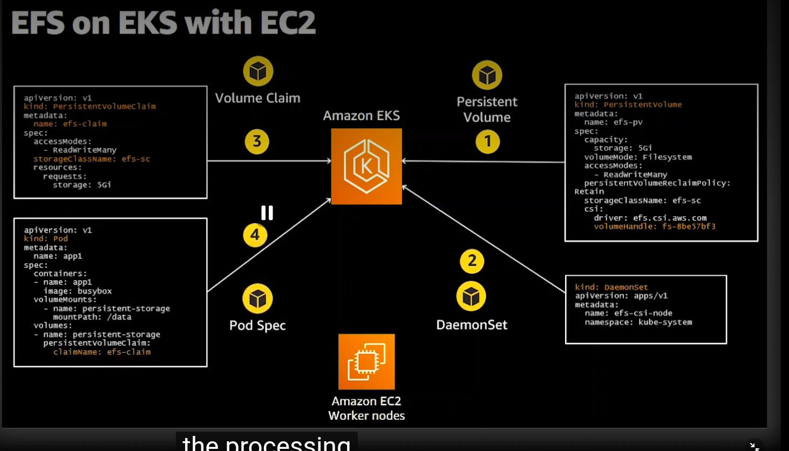
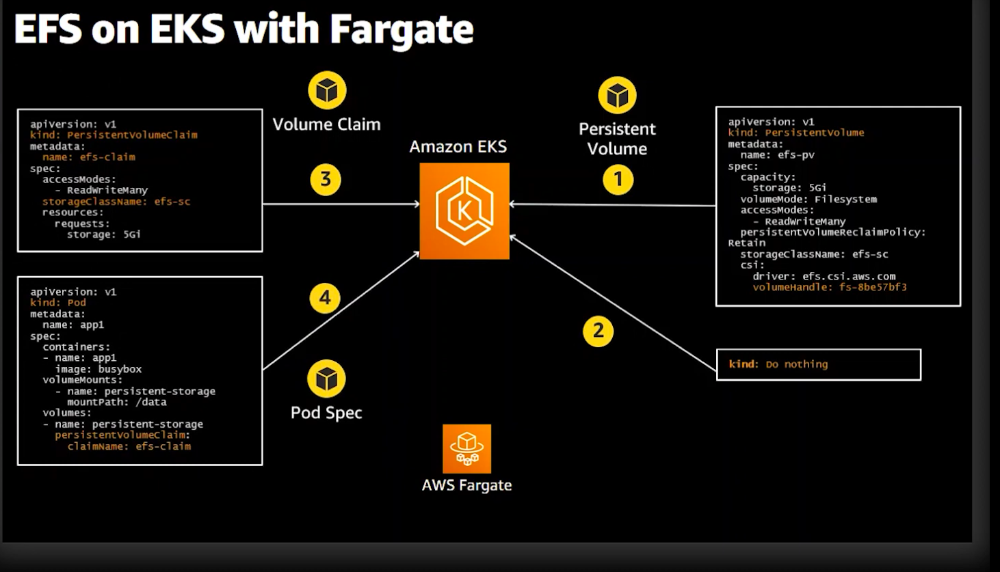

# Containers on AWS

- **Amazon ECS (Elastic Container Service):** Highly scalable, high-performance container management service.
    - **Control Plane:** AWS managed; you only manage the data plane (compute).
    - **Integration:** Deeply integrated with AWS native services (IAM, ALB/NLB, CloudWatch, Secrets Manager).

    - **Architecture Description:** The image shows how the ECS Cluster organizes tasks and services. It highlights the use of Task Definitions to declare the container images, CPU/Memory requirements, and IAM Task Roles, and how services maintain the desired number of tasks (pods) across the cluster, optionally using Fargate for serverless compute.

- **Amazon EKS (Elastic Kubernetes Service):** Managed Kubernetes service.
    - **Control Plane:** AWS manages the Kubernetes control plane across multiple AZs.
    - **Use Case:** When portability (standard Kubernetes APIs) and complex service-to-service orchestration are required.

### Launch Types
- **Fargate (Serverless):** No need to provision or manage servers. AWS manages the underlying infrastructure.
    - *Fargate Construction:* You define task-level CPU and memory requirements in the task definition. Fargate then provisions the compute resources required to run your containers based on these definitions.

    - *Fargate Isolation:* Fargate provides strong workload isolation by running each task in its own dedicated kernel/compute environment, ensuring container isolation.

- **EC2:** You manage the underlying instances, allowing deep control over OS, networking, and instance sizing.

### Fargate on EKS

You have 3 options to run EKS pods:
- **Managed EC2:** AWS helps you with some operations on the EC2 instances.
- **EC2:** You are responsible for the application and infrastructure.
### EKS Node Management

| Feature | Managed Node Groups | Self-Managed Nodes |
| :--- | :--- | :--- |
| **Lifecycle Management** | **Automated** (Patching/Upgrade) | **Manual** |
| **Customization** | Standardized (EKS Optimized AMI) | High (Custom AMI/Kernel tuning) |
| **Scaling** | Integrated (Automatic) | Manual / Cluster Autoscaler |
| **Operational Effort** | Low | High |
| **Best For** | Most Production Workloads | Specialized Requirements |

- **Managed Node Groups:** Recommended for most production workloads. AWS automates node upgrades and patching.
- **Self-Managed Nodes:** Required only if you need highly custom OS configurations, kernel tuning, or specific hardware drivers that standard EKS-optimized AMIs do not provide.

### Amazon EFS on EKS

- **Amazon EFS CSI Driver:** To mount Amazon EFS file systems on EKS clusters, you must install the Amazon EFS CSI driver.
    - **How it works:** The driver manages the lifecycle of EFS mounts for your pods. You define a `StorageClass` pointing to your EFS File System ID.
    - **Persistence:** Allows multiple pods across different Availability Zones to share the same persistent file storage.

- **EKS with EC2:**
    - **Configuration:** EC2 nodes mount EFS directly via the CSI driver. High performance and low latency.
    - **Use Case:** High-throughput, compute-intensive applications requiring shared file storage.

- **EKS with Fargate:**
    - **Configuration:** Fargate supports mounting EFS volumes using the CSI driver, enabling persistent, shared storage for serverless pods.
    - **Use Case:** Serverless applications requiring persistent shared storage without managing underlying nodes.

- **Docker Compose for ECS:** You can use `docker-compose.yml` to define multi-container applications and deploy them to Amazon ECS using the `docker ecs compose` command.

- **Advanced Architectural Considerations:**
    - **IAM Task Roles:** Assign permissions to the *container/task* itself (not the underlying host), allowing the application to securely access AWS services (S3, DynamoDB) via IAM.
    - **Networking (`awsvpc` mode):** Every ECS task receives its own Elastic Network Interface (ENI) and private IP within the VPC, allowing security groups to be applied directly to the container/task.
    - **Service Discovery:** Use Route 53 Service Discovery (AWS Cloud Map) to automatically register and discover services within your VPC.
    - **Scalability:** **Service Auto Scaling** allows scaling tasks based on CPU/Memory utilization or custom metrics (e.g., SQS queue depth).
