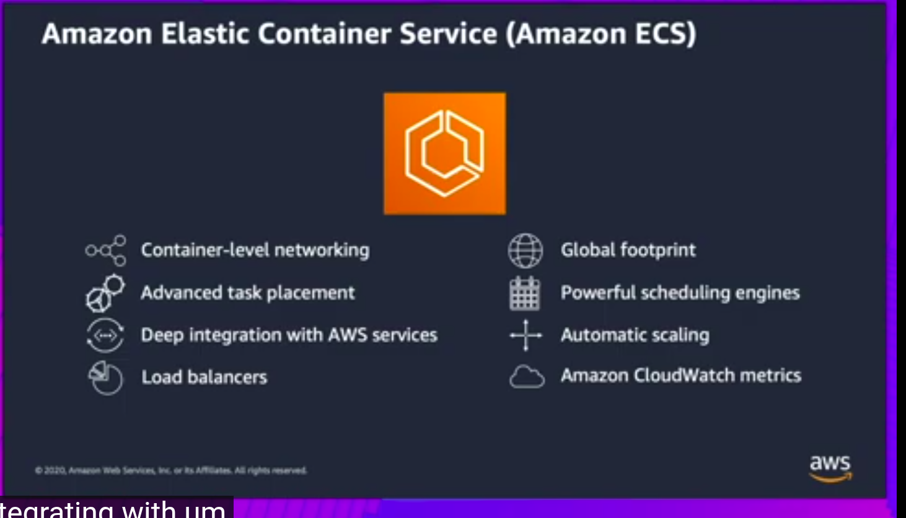
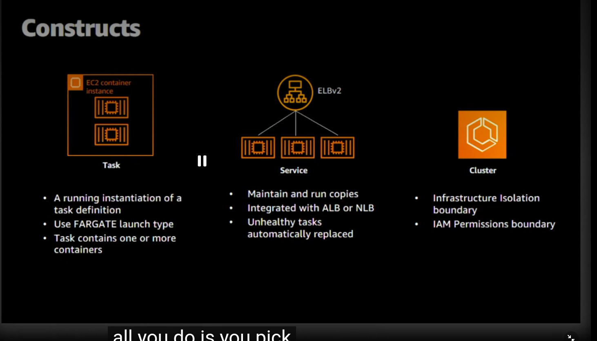
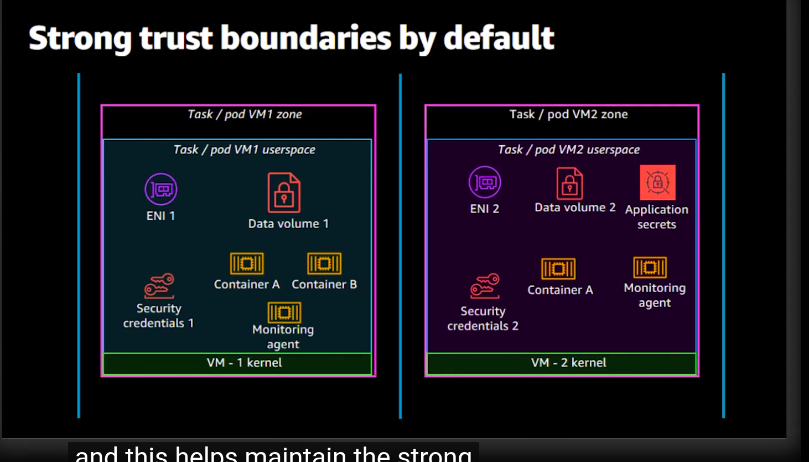
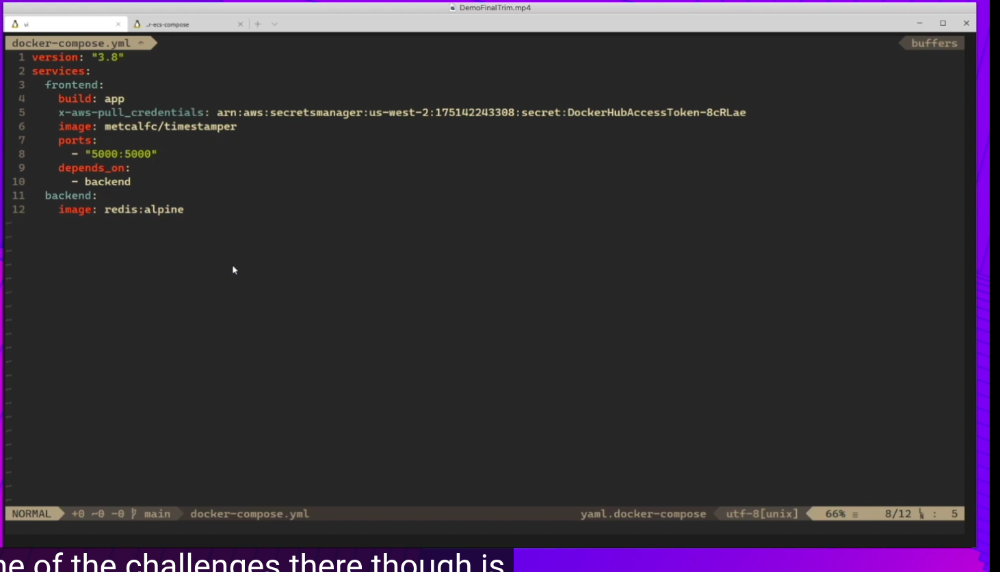
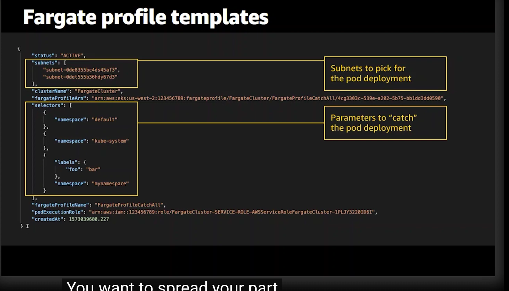

# Containers on AWS

- **Amazon ECS (Elastic Container Service):** Highly scalable, high-performance container management service.
    - **Control Plane:** AWS managed; you only manage the data plane (compute).
    - **Integration:** Deeply integrated with AWS native services (IAM, ALB/NLB, CloudWatch, Secrets Manager).

    - **Architecture Description:** The image shows how the ECS Cluster organizes tasks and services. It highlights the use of Task Definitions to declare the container images, CPU/Memory requirements, and IAM Task Roles, and how services maintain the desired number of tasks (pods) across the cluster, optionally using Fargate for serverless compute.

- **Amazon EKS (Elastic Kubernetes Service):** Managed Kubernetes service.
    - **Control Plane:** AWS manages the Kubernetes control plane across multiple AZs.
    - **Use Case:** When portability (standard Kubernetes APIs) and complex service-to-service orchestration are required.

### Fargate (Serverless)

**Fargate**
Serverless compute engine. ECS and EKS can run on target.

- *Fargate Construction:* You define task-level CPU and memory requirements in the task definition. Fargate then provisions the compute resources required to run your containers based on these definitions.

- *Fargate Isolation:* Fargate provides strong workload isolation by running each task in its own dedicated kernel/compute environment, ensuring container isolation.

- **EC2:** You manage the underlying instances, allowing deep control over OS, networking, and instance sizing.

- **Docker Compose for ECS:** You can use `docker-compose.yml` to define multi-container applications and deploy them to Amazon ECS using the `docker ecs compose` command.

- **Advanced Architectural Considerations:**
    - **IAM Task Roles:** Assign permissions to the *container/task* itself (not the underlying host), allowing the application to securely access AWS services (S3, DynamoDB) via IAM.
    - **Networking (`awsvpc` mode):** Every ECS task receives its own Elastic Network Interface (ENI) and private IP within the VPC, allowing security groups to be applied directly to the container/task.
    - **Service Discovery:** Use Route 53 Service Discovery (AWS Cloud Map) to automatically register and discover services within your VPC.
    - **Scalability:** **Service Auto Scaling** allows scaling tasks based on CPU/Memory utilization or custom metrics (e.g., SQS queue depth).
For the security model
- Tasks get isolated compute
- Network isolation ENI by tasks
- Storage isolation 
 Credential isolation.

### Fargate on EKS

You have 3 options to run EKS pods:

- **Managed EC2:** AWS helps you with some operations on the EC2 instances.
- **EC2:** You are responsible for the application and infrastructure.
- **Fargate:** Serverless compute engine. Use the Fargate scheduler to run pods without managing nodes.
    - *Fargate Profile:* Defines which pods run on Fargate by specifying selectors (namespaces and labels).

