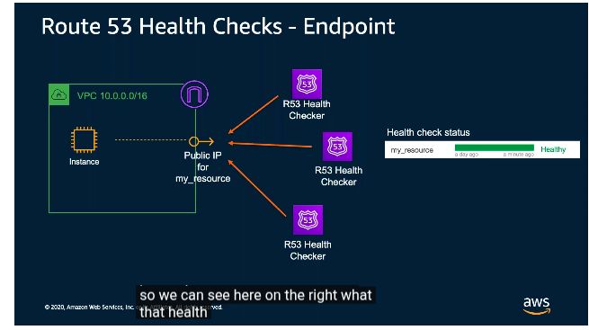
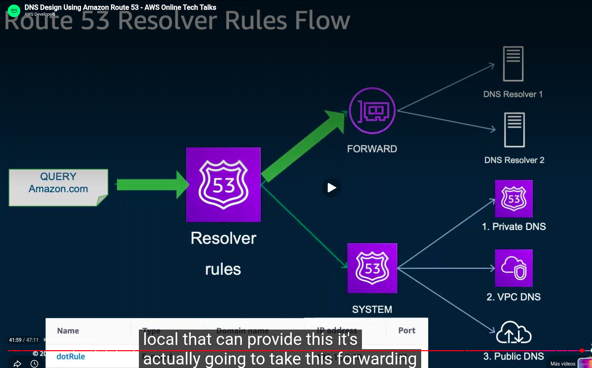
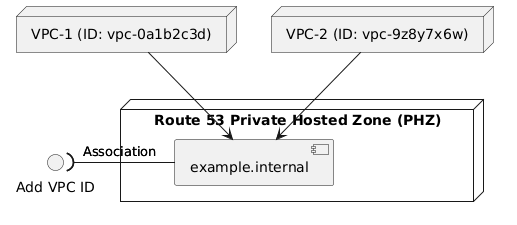
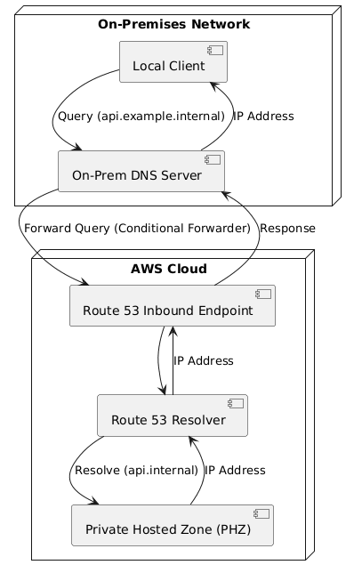
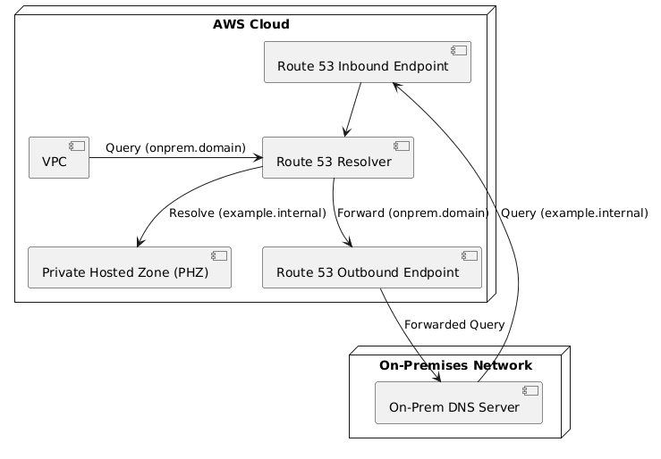

# Route 53 & DNS

- **Routing Policies:** Simple, Weighted, Latency, Geolocation, Failover, Multivalue Answer.
- **Health Checks & Traffic Flow:** Monitor health, automated failover, and visual routing chaining.



- **AWS Route 53 Resolver (Hybrid DNS)** — Bridges DNS resolution across hybrid environments and multi-VPC setups.
    - **Problem Solved:** Traditionally, DNS resolution was siloed between on-premises DNS and AWS VPC-local DNS. An instance in a VPC could not resolve an on-premises hostname (e.g., `db.corp.local`), and an on-premises server could not resolve a private AWS hostname (e.g., `api.internal.aws`).
    - **Inbound Endpoints:** Allow on-premises DNS to forward queries for an AWS domain (e.g., `*.internal.aws`) to AWS.
    - **Outbound Endpoints + Resolver Rules (Forwarding):** Allow AWS resources to resolve on-premises DNS domains (e.g., `corp.local`) via forwarding rules.
        - *Setup:* Create an **AWS Route 53 Resolver Rule** (type: **Forward**) for the target domain pointing to your on-premises DNS server IPs, and associate this rule with your VPC(s).

### Resolver Rule Example Table

| Domain Name | Rule Type | Target IP Address(es) | Description |
| :--- | :--- | :--- | :--- |
| `corp.local` | Forward | `192.168.1.10`, `192.168.1.11` | Resolves on-prem AD/Database servers |
| `dev.internal` | Forward | `10.50.10.5` | Resolves legacy services in a peered data center |
| `.` (Root) | System | N/A | Default AWS resolution (Internal PHZs/Public) |



```text
       [ VPC Instance ]
              | Query (db.corp.local)
              v
       [ Route 53 Resolver ]
              | Rule: "corp.local" -> Forward
              v
       [ Outbound Endpoint (ENI) ]
              |
      (Private Link: VPN/DX)
              |
       [ On-Prem DNS Server ]
              | Resolve (db.corp.local)
              v
       [ Result returned to VPC ]
```

- **Private Hosted Zones (PHZ):** DNS domains configured *only* for specific VPCs. Not resolvable from the internet.
    - **Cross-VPC DNS Resolution:** A single PHZ can be associated with multiple VPCs.
        - *Explicit Association:* You must explicitly associate each VPC with the PHZ by adding the **VPC ID** in the Route 53 console.
    - **Prerequisites:**
        - `enableDnsSupport` = `true`
        - `enableDnsHostnames` = `true`
        - VPCs must have network connectivity to the Route 53 Resolver IP (`169.254.169.253`).




