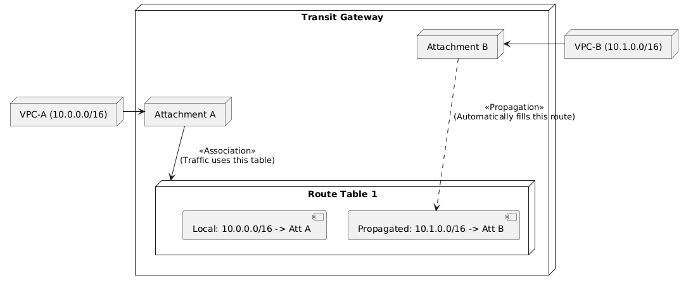

# Hybrid Networking

- **AWS Transit Gateway (TGW)** — regional hub for connecting VPCs, VPNs, and Direct Connect; supports routing domains (Route Tables) for traffic segmentation (Association/Propagation).
    - **Logical Components:** Attachments (pipes), Associations (mapping traffic to a route table), and Propagations (dynamic route population).
    - **TGW Attachments (What can it connect to?):**
        - **VPC Attachments:** Connects VPCs to the TGW.
        - **VPN Attachments:** Connects Site-to-Site VPNs to the TGW.
        - **Direct Connect Gateway Attachments:** Connects Direct Connect to the TGW via a Direct Connect Gateway.
        - **Transit Gateway Peering Attachments:** Connects two separate TGWs (intra-region or inter-region).
        - **Connect Attachments (SD-WAN):** Uses GRE tunnels to connect SD-WAN appliances directly to the TGW.

- **AWS Site-to-Site VPN** — Establishes encrypted IPsec tunnels between your on-premises network and AWS.
    - **Components:**
        - **Customer Gateway (CGW):** The on-premises device/firewall (the VPN endpoint on your side).
        - **AWS Termination Points (Managed Service):**
            - **Virtual Private Gateway (VGW):** The *standard* AWS-side VPN endpoint for connecting to a **single VPC**.
            - **Transit Gateway (TGW):** An *optional, advanced* hub for connecting **multiple VPCs** and on-premises networks.
        - **Note on EC2/ALB:**
            - **ALBs** cannot terminate Site-to-Site VPNs (they are Layer 7).
            - **EC2 Instances** can only terminate VPNs if you deploy a **custom software VPN appliance** (DIY). You are responsible for managing/scaling/HA of that instance (as opposed to the managed VGW/TGW service).
    - **High Availability:** Always provisions two tunnels; both must be configured on your CGW.
    - **Routing:** Supports Static or Dynamic (BGP) routing.
    - **NAT Traversal (NAT-T):** Essential if the CGW is behind a NAT device; encapsulates ESP in UDP/4500.

- **AWS Client VPN** — A managed, client-based remote-access VPN service.
    - **Use Case:** Individual remote access for employees/contractors to access private VPC resources from any location.
    - **How it works:** User installs an OpenVPN-compatible client, establishes a secure TLS tunnel to the AWS Client VPN endpoint. Authenticates via AD, SAML (Okta/Entra ID), or certificates.
    - **Association:** Client VPN endpoints are associated with one or more subnets in a VPC. When associated, an ENI is created in those subnets, allowing the Client VPN to route traffic to the VPC.
    - **Security Groups:** Attached to the Client VPN endpoint association; they control inbound traffic from the Client VPN ENIs *to* the VPC resources.
    - **Authorization Rules:** You must explicitly add authorization rules to the Client VPN endpoint to grant access to specific network segments (e.g., VPC CIDR, on-premises networks reachable via TGW/VGW).
    - **Route Table:** The Client VPN endpoint has its own route table. You must configure routes (e.g., 10.0.0.0/16 → VPC network interface) to determine where traffic is sent once it exits the VPN tunnel.

- **AWS Direct Connect (DX)** — A dedicated private network link from on-premises to AWS.
    - **Physical Endpoint:** A cross-connect at an AWS Direct Connect location.
    - **Logical Endpoints (Virtual Interfaces - VIFs):**
        - **Private VIF:** Access an Amazon VPC using private IP addresses. Connect to a VGW (single VPC) or a Direct Connect Gateway (DXGW).
        - **Public VIF:** Access AWS services from your on-premises data center.
        - **Transit VIF:** Access one or more VPC Transit Gateways (TGW) associated with Direct Connect gateways. Used with 1/2/5/10/100 Gbps Direct Connect connections.
    - **Direct Connect Gateway (DXGW):** A global construct that allows connecting a DX to VPCs across *different* regions.
    - **Invalid Termination Points:** You cannot terminate a Direct Connect VIF directly on an **EC2 Instance**, **Load Balancer (ALB/NLB)**, **Internet Gateway**, or **NAT Gateway**. DX VIFs require a BGP session and must terminate on specialized routing constructs (VGW/DXGW).
    - **Note:** It is *not encrypted* by default. Layer a VPN or use MACsec for encryption.

- **AWS Global Accelerator** — Improves availability/performance by routing user traffic over the AWS global network via Anycast IP addresses.
    - **Use Case:** Ideal for TCP/UDP applications (non-HTTP) where network performance and fast failover are required.
    - **vs. CloudFront:** Use CloudFront for caching HTTP content; use Global Accelerator for network-level acceleration of any TCP/UDP traffic.

## Diagrams

### TGW Logical Components


### Managed Service Failover (VGW)
```text
    [On-Premises Network]
              |
     +--------+--------+
     |  Dual IPsec     |
     |   Tunnels       |
     +--------+--------+
              |
    +---------v---------+
    |   AWS VGW/TGW     |
    +---------+---------+
              |
      [VPC Route Table]
```

### Site-to-Site VPN Architecture


### Client VPN Route Table


### Client VPN Association


### Virtual Interface (VIF) Architecture


### Global Accelerator

