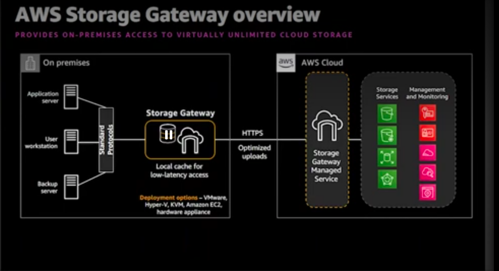

# Specialized Infrastructure

- Placeholder for Storage Gateway, Outposts, Snow Family, etc.

- File Gateway
nfs, smb
store and access object in S3.
- Tape Gateway
drop-in replacemente for phsucial tape infraestructure backed by cloud storage with local caching

- Volume Gateway
block storage on premsised by cloud storage with lcoal caching, amazon ebs, snapt shot, integrated with aws backup
