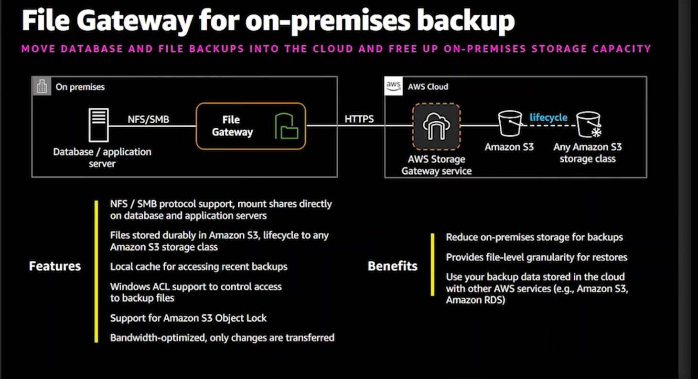
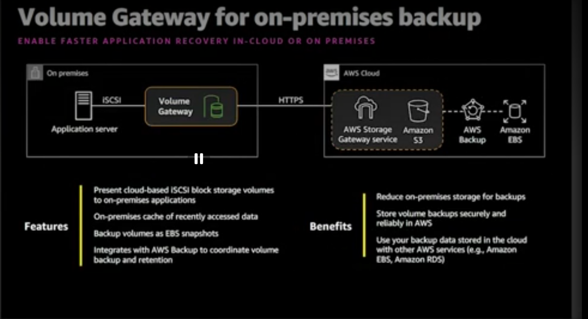
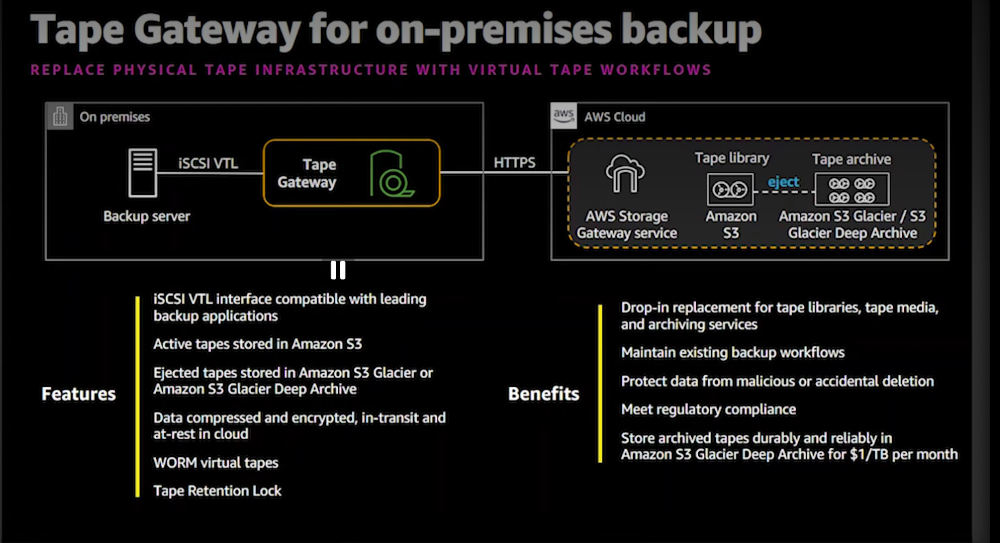
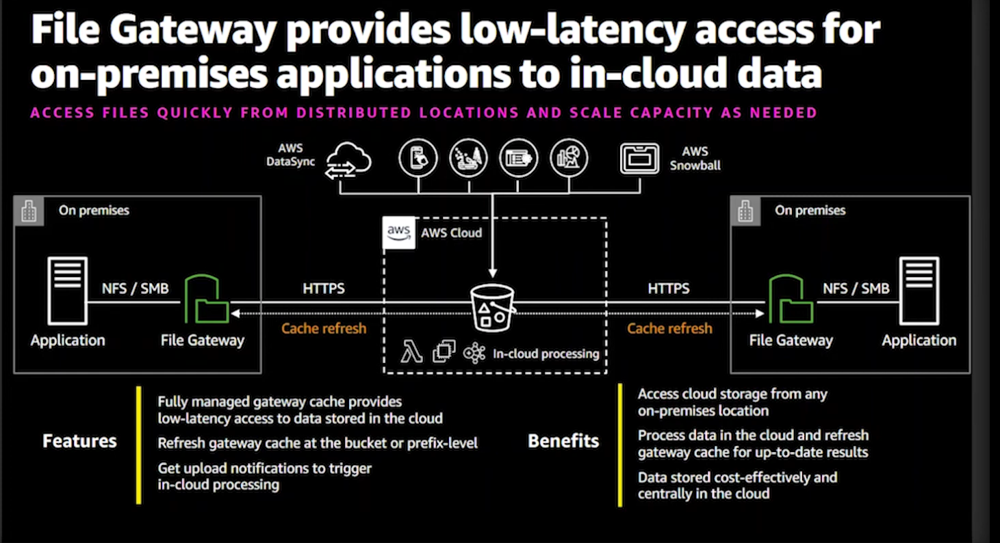

## Gateway Decision Matrix

| Gateway Type | Decision Point | Professional Architect Insight |
| :--- | :--- | :--- |
| **Volume Gateway** | Cached vs. Stored | Choose **Stored** for 100% local residency/performance. Choose **Cached** for cloud-based scalability. |
| **S3 File Gateway** | Local Cache Size | Performance is directly tied to the cache size. Size cache to cover the "working set" of files. |
| **Tape Gateway** | Archival Class | Choose **Glacier Deep Archive** for lowest cost, but account for longer retrieval times (hours). |

---
    - **Benefits:**
        - **Low-Latency Access:** Provides local cached access to data stored in the cloud.
        - **Seamless Integration:** Works with existing on-premises applications/file systems using standard storage protocols (NFS, SMB, iSCSI).
        - **Security:**
        - **Data in Transit:** All traffic encrypted via **TLS** between the appliance and AWS.
        - **Data at Rest:** Encrypted via **KMS** (AWS-managed or Customer Managed Keys).
        - **Network:** Use **VPC Endpoints (PrivateLink)** to keep traffic off the public internet.
        - **Access Control:** Use **Least Privilege IAM Roles** for the gateway's access to S3/EBS; ensure S3 buckets have **Block Public Access** enabled.
        - **Simplified Management:** Replaces expensive, complex on-premises backup and storage infrastructure with a simple virtual appliance.
        - **Cost-Effective:** Reduces on-premises storage footprint by tiered caching, keeping active data local and cold data in S3.
    - **Types & Supported Protocols:**
        - **S3 File Gateway:** 
            - **Protocols:** NFS (v3, v4.1) and SMB (v2, v3). Referred to as "File Storage Gateway".

            - **Use Case:** Storing files in S3 while maintaining a local cache for low-latency access.

        - **Volume Gateway:**
            - **Protocols:** iSCSI.

            - **Modes:**
                - **Cached Volumes:** Primary data is stored in S3, while frequently accessed data is cached locally on-premises for low latency. Ideal for offloading on-premises storage costs while maintaining performance.
                - **Stored Volumes:** Entire dataset is stored on-premises (local disk) for maximum performance, with asynchronous backups to S3 as EBS snapshots. Ideal for legacy applications requiring local data residency.
            - **Use Case:** Providing block storage volumes (backed by EBS snapshots) to on-premises applications, integrated with AWS Backup.

        - **Tape Gateway:**
            - **Protocols:** iSCSI-VTL (Virtual Tape Library).

            - **Functionality:** Presents an iSCSI-based virtual tape library to on-premises backup applications. Backup data is written to virtual tapes, which are then asynchronously archived to S3 Glacier (Flexible Retrieval or Deep Archive).
            - **Operations:** 
                - **Tape Creation:** You create virtual tapes in the AWS Management Console, which appear in your on-premises backup software.
                - **Ejection/Archival:** When a backup is complete, you "eject" the tape. The gateway then automatically moves the tape's data from local storage to S3 Glacier.
                - **Retrieval:** If you need to restore data, you must "retrieve" the tape from Glacier back to the Tape Gateway, which can take several hours depending on the Glacier storage class.
            - **Use Case:** Replacing physical tape infrastructure for archival backups, integrated with S3 Glacier.

### Data Transfer Options

- **AWS DataSync:**
    - **Use Case:** Online data transfer service for moving large amounts of data between on-premises storage and AWS (S3, EFS, FSx) or between AWS storage services.
    - **Mechanism:** Uses a specialized software agent (deployed on-premises) to optimize network bandwidth and ensure data integrity via automatic verification.
    - **Best For:** Frequent, ongoing data transfers and migrations.

- **AWS Snow Family (Snowcone, Snowball, Snowmobile):**
    - **Use Case:** Offline data transfer for large-scale data migrations where network bandwidth is a bottleneck or unavailable.
    - **Mechanism:** AWS ships physical, ruggedized devices to your location. You load data onto them, ship them back, and AWS imports the data directly into S3.
    - **Best For:** Massive, one-time data migrations ("Data migration" vs. DataSync's "Data transfer").

